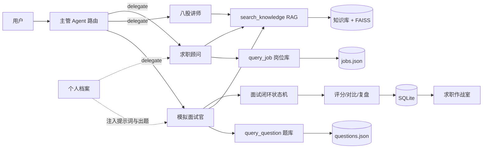

# 🎓 AI 面试备战助手

面向「大模型 / AI 应用开发」第一次实习的多 Agent + RAG 面试陪练应用。它不是一个通用聊天玩具，而是**绑定你个人档案**的陪练：面试官会根据你的真实项目深挖追问，做完面试给出结构化评分与成长曲线，面经复盘自动归档成行动清单。

## 它解决了什么

第一次找实习的人通常有四个痛点，这个项目逐一对应：

| 痛点 | 项目的解法 |
| --- | --- |
| 没人陪练、练习没反馈 | 主管 Agent 路由，模拟面试官 / 八股讲师 / 求职顾问三个专员协作，Function Calling 驱动真实工具调用 |
| 复习没重点、八股全靠背 | RAG 知识库（8 份文档 / 90 道题库）提供有依据的讲解；关键词 + 向量 RRF 混合检索，Recall@K / MRR 可量化 |
| 面试必问项目，但不会讲 | 「我的档案」绑定你的真实项目，面试自动插入约 30% 项目深挖题（技术选型 / 难点 / 量化 / 失败与改进） |
| 练了没进步、复盘靠感觉 | 整场评分（5 维度）+ 历史对比 + 求职作战室（得分趋势 / 薄弱维度 / 待办清单 / 复盘归档） |

## 技术栈与亮点

- **手写多 Agent Harness**：主管路由 + 三个专员，通用 Function Calling 循环（AgentLoop），统一轨迹追踪，不依赖 LangGraph——能讲清 tool_calls 解析、路由、记忆注入、容错与评估
- **RAG 混合检索**：Markdown 标题感知分块；关键词（jieba）+ 向量（FAISS + m3e）RRF 融合，索引持久化 + 文档指纹重建；embedding 模型单例缓存，无网自动降级关键词
- **面试闭环状态机**：出题 → 逐题作答 → 点评追问 → 整场评分 → 历史对比 → 面经复盘，每环节结构化 JSON，落库可回看
- **个性化档案**：SQLite 持久化，档案注入面试官 / 求职顾问提示词，出题结合真实项目
- **工程健壮性**：LLM 调用指数退避重试、JSON 解析兜底、多级降级（题库兜底出题、关键词兜底向量检索）
- **测试与评估**：18 项 pytest（路由 / 专员权限 / 记忆 / RAG / 面试闭环 / 档案 / 复盘）+ 3 个离线 eval 脚本

## 快速开始

```bash
# 1. 配置 API Key
cp .env.example .env   # 填入 DEEPSEEK_API_KEY

# 2. 双击 start.command（自动建虚拟环境 + 安装依赖 + 打开网页）
# 或手动：
python3 -m venv .venv
.venv/bin/pip install -r requirements.txt
.venv/bin/streamlit run ui/app.py
```

打开 http://localhost:8501，建议使用顺序：
1. **我的档案**：填目标岗位 + 技能栈 + 三个真实项目（投满分 BERT / 本地知识库问答 / 本 Agent）
2. **模拟面试**：选方向开始，会看到「含 N 道项目深挖题」
3. **自由对话**：试试「讲讲 RAG 的原理」「广州有哪些大模型实习」
4. **求职作战室**：几场之后看趋势、薄弱维度与待办清单

可选开启向量检索 RAG（首次运行会下载 m3e-base，需要网络）：
```bash
.venv/bin/pip install -r requirements-rag.txt
```

## 目录结构

```
backend/app/
├── agent/
│   ├── loop.py          # 通用 Agent 循环（Function Calling 引擎，带重试）
│   ├── roles.py         # 主管 + 3 专员提示词与工具子集
│   ├── harness.py       # 多 Agent 编排（档案注入 + 路由 + 轨迹）
│   ├── memory.py        # 会话记忆（SQLite 回填）
│   └── rag.py           # RAG 检索（关键词/向量 RRF，模型单例缓存）
├── interview.py         # 面试闭环：出题（含项目深挖）/点评/评分/对比/复盘
├── interview_store.py   # 面试场次与问答持久化
├── profile.py           # 个人档案（目标岗位/技能栈/项目经历）
├── review_store.py      # 面经复盘持久化
├── llm_utils.py         # LLM 指数退避重试
├── tools/               # 工具注册中心（题库/岗位库/知识库检索）
└── db.py                # SQLite 表结构（会话/面试/档案/复盘）
ui/app.py                # Streamlit：自由对话/模拟面试/面经复盘/求职作战室/历史报告/我的档案
data/knowledge/          # 8 份面试知识库（约 340 行）
data/questions.json      # 90 道题库（python/database/network/os/ai/algorithm/project）
data/jobs.json           # 16 条实习岗位库
scripts/                 # eval_agent / eval_rag / eval_interview 离线评估
tests/                   # 18 项 pytest
```

## 架构



## 面试怎么讲

这个项目本身是你面试的最大素材，建议按这个顺序讲：

1. **一句话定位**：面向 AI 开发实习的多 Agent + RAG 面试陪练，绑定了我的真实项目做个性化深挖，并给出可量化的成长曲线。
2. **为什么手写 Harness 不用 LangGraph**：学习项目目标是理解底层——tool_calls 解析、路由、记忆注入、轨迹。手写代码可控、可测试、可讲原理；工程上也会评估框架，这是取舍能力的体现。
3. **RAG 为什么用混合检索 + RRF**：关键词擅长精确匹配（专有名词、编号），向量擅长语义召回；RRF 融合两路结果（score = Σ 1/(k+rank)），避免新词/错别字导致召回失败。用 Recall@K / MRR 量化验证，而不是拍脑袋。
4. **面试闭环怎么设计**：状态机管理「出题→作答→点评→评分」，考核与面试解耦；历史对比让训练效果可感知。
5. **档案驱动的个性化**：面试官提示词注入候选人档案，出题时插入约 30% 项目深挖题；项目题 LLM 定制失败会自动回退模板，保证流程不中断。
6. **工程细节与反思**：embedding 模型单例缓存（修掉每次检索重复加载模型的问题）、LLM 重试与多级降级、18 项测试覆盖核心链路；诚实说明边界（并发与安全是二期方向）。

## 面试记录在哪里

所有数据存本地 SQLite（`data/interview.db`）：会话历史、面试场次、问答记录、个人档案、面经复盘，删除对应记录即可清理。

## 进阶方向（二期）

- FastAPI + 独立前端，云端多人使用
- 简历自动解析 + 岗位匹配度打分
- 多模型切换与语音面试
