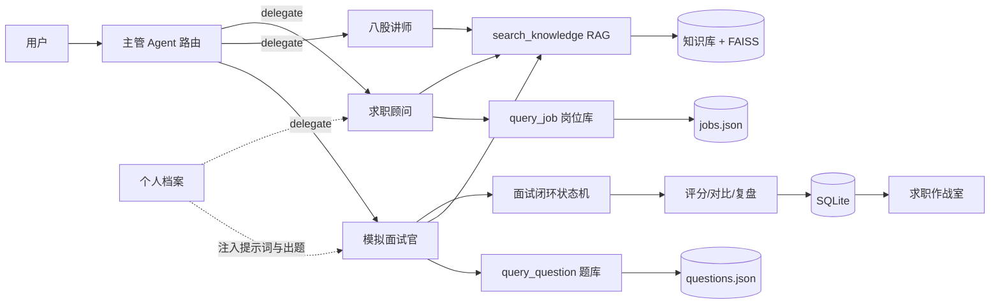

# 🎓 AI 面试备战助手

面向「大模型 / AI 应用开发」第一次实习的多 Agent + RAG 面试陪练应用。它不是一个通用聊天玩具，而是**绑定你个人档案 + 目标 JD** 的陪练：面试官会根据你的真实项目与岗位要求深挖追问，做完面试给出评分标准驱动的结构化报告与学习计划，面经复盘自动归档成行动清单。

> 架构借鉴：[DeepInterview](https://github.com/ngoanpv/DeepInterview)（Apache-2.0）的 prep/live/post 三段式与 rubric 评分；[聆悟 ai-interview-platform](https://github.com/yuanzhongqiao/ai-interview-platform)（MIT）的自然语言面试设计与统一评分标准。代码为本项目重写实现。

## 它解决了什么

第一次找实习的人通常有四个痛点，这个项目逐一对应：

| 痛点 | 项目的解法 |
| --- | --- |
| 没人陪练、练习没反馈 | 主管 Agent 路由，模拟面试官 / 八股讲师 / 求职顾问三个专员协作，Function Calling 驱动真实工具调用 |
| 复习没重点、八股全靠背 | RAG 知识库（8 份文档 / 90 道题库）提供有依据的讲解；关键词 + 向量 RRF 混合检索，Recall@K / MRR 可量化 |
| 面试必问项目，但不会讲 | 「我的档案」绑定你的真实项目，面试自动插入约 30% 项目深挖题（技术选型 / 难点 / 量化 / 失败与改进） |
| 练了没进步、复盘靠感觉 | 评分标准驱动的整场评分（能力分 0-5 + 5 维度 + 表达报告）+ 学习教练生成补强计划 + 历史对比 + 求职作战室 |

## 面试全流程（prep → live → post）

- **prep 面试前**：粘贴目标 JD → 自动解析岗位画像（必须项/加分项/职责/技术栈）→ 与你的档案做差距分析（优势/gaps/应深挖点）→ 生成完整问题计划：每道题带难度曲线（1-5）、考察能力、评分标准（rubric）、追问种子；也支持"一句话描述考察目标 → 自动生成完整面试设计"
- **live 面试中**：面试官按评分标准点评并给出 0-5 分，追问方向提前可见
- **post 面试后**：逐题 rubric 评分 → 能力分聚合（0-5 + 扎实/合格/待练/薄弱）→ 改进版参考答案（只挑最弱题）→ 学习教练按弱能力生成补强模块，并用知识库检索学习材料

## 技术栈与亮点

- **手写多 Agent Harness**：主管路由 + 三个专员，通用 Function Calling 循环（AgentLoop），统一轨迹追踪，不依赖 LangGraph——能讲清 tool_calls 解析、路由、记忆注入、容错与评估
- **RAG 混合检索**：Markdown 标题感知分块；关键词（jieba）+ 向量（FAISS + m3e）RRF 融合，索引持久化 + 文档指纹重建；embedding 模型单例缓存，无网自动降级关键词
- **面试闭环状态机（prep/live/post）**：JD 画像与差距分析 → 评分标准驱动的问题计划 → 逐题评分 → ScoreCard 报告 → 学习教练，每环节结构化 JSON，落库可回看
- **个性化档案 + 目标 JD**：SQLite 持久化，档案与 JD 画像注入面试官 / 求职顾问提示词，出题结合真实项目与岗位要求
- **岗位问题包**：data/packs/ 下的岗位 playbook（round structure / question bank / signals / pitfalls）注入出题提示词
- **工程健壮性**：LLM 调用指数退避重试、JSON 解析兜底、多级降级（题库兜底出题、关键词兜底向量检索）
- **测试与评估**：20 项 pytest（路由 / 专员权限 / 记忆 / RAG / prep-post 面试闭环 / 档案 / 复盘 / 学习教练）+ 3 个离线 eval 脚本

## 量化验证（真实跑出的指标）

| 模块 | 指标 | 结果 | 评测集 |
| --- | --- | --- | --- |
| RAG 检索 | Recall@3 | **0.929** | 14 条 query→期望来源文档 |
| RAG 检索 | MRR | **0.750** | 同上 |
| 多 Agent 路由 | 路由准确率 | **100%** | 16 条意图（3 专员 + 寒暄） |
| 多 Agent 工具 | 工具准确率 | **100%** | 期望工具是否被调用 |
| 多 Agent 回答 | 回答完整率 | **100%** | 是否产出有效回答 |
| 面试闭环 | 出题/点评追问/评分/复盘完整率 | **100%** | 4 个方向出题 + 2 组问答 + 整场评分 + 复盘 |
| 自动化测试 | pytest | **20/20 通过** | 路由/权限/记忆/RAG/闭环/档案/复盘/教练 |
| 前端 | tsc 类型检查 + Vite 构建 | 0 错误 | 桌面 1280×860 / 移动 390×844 无溢出 |

复现方式：`scripts/eval_rag.py`、`scripts/eval_agent.py`、`scripts/eval_interview.py`（后两者需要 API Key），CI 自动跑 pytest 与前端构建。

## 能力边界与降级策略

| 场景 | 行为 |
| --- | --- |
| LLM 返回非法 JSON | `_extract_json` 正则兜底提取；仍失败则回退题库 / 模板出题 |
| 工具调用失败 / 参数非法 | 错误信息回填模型重新规划；未知工具返回明确提示 |
| RAG 检索无结果 | 如实告知"知识库未收录"，不编造答案 |
| 未安装向量检索依赖 | 自动降级 jieba 关键词检索（零额外依赖可跑） |
| 未配置 API Key | 界面正常打开，AI 功能给出配置提示；测试 / CI 不依赖 Key |
| Agent 迭代超限 | 返回友好提示，建议换问法 |
| 端口被占用 | 启动脚本检测后直接打开已运行的服务，不重复启动 |

## 快速开始

新版为 **React + Vite + Tailwind** 前端 + **FastAPI** 后端（沿用全部 Python 业务逻辑）：

```bash
# 1. 配置 API Key
cp .env.example .env   # 填入 DEEPSEEK_API_KEY

# 2. 双击 start.command（自动建虚拟环境 + 构建前端 + 启动服务 + 打开网页）
# 或手动：
python3 -m venv .venv
.venv/bin/pip install -r requirements.txt
cd web && npm install && npm run build && cd ..
.venv/bin/uvicorn server.main:app --host 127.0.0.1 --port 8000
```

打开 http://localhost:8000，建议使用顺序：
1. **我的档案**：填目标岗位 + 技能栈 + 三个真实项目（投满分 BERT / 本地知识库问答 / 本 Agent）
2. **我的档案**：粘贴目标 JD → 保存后自动解析岗位画像与差距分析
3. **模拟面试**：选方向开始（或「自定义面试设计」一句话生成），会看到「含 N 道项目深挖题」+ 每题的评分标准与追问方向
4. **自由对话**：试试「讲讲 RAG 的原理」「广州有哪些大模型实习」
5. **求职作战室**：几场之后看趋势、薄弱维度与学习教练待办

可选开启向量检索 RAG（首次运行会下载 m3e-base，需要网络）：
```bash
.venv/bin/pip install -r requirements-rag.txt
```

## 目录结构

```
backend/app/
├── agent/
│   ├── loop.py          # 通用 Agent 循环（Function Calling 引擎，带重试）
│   ├── roles.py         # 主管 + 3 专员提示词与工具子集
│   ├── harness.py       # 多 Agent 编排（档案注入 + 路由 + 轨迹）
│   ├── memory.py        # 会话记忆（SQLite 回填）
│   └── rag.py           # RAG 检索（关键词/向量 RRF，模型单例缓存）
├── interview.py         # 面试闭环：出题（含项目深挖）/点评/评分/对比/复盘
├── interview_store.py   # 面试场次与问答持久化
├── profile.py           # 个人档案（目标岗位/技能栈/项目经历）
├── review_store.py      # 面经复盘持久化
├── llm_utils.py         # LLM 指数退避重试
├── tools/               # 工具注册中心（题库/岗位库/知识库检索）
└── db.py                # SQLite 表结构（会话/面试/档案/复盘）
web/                     # 新版前端：React + Vite + Tailwind（对话/模拟面试/复盘/作战室/历史/档案）
server/main.py           # FastAPI：聊天 SSE + 面试闭环 + 档案 + 复盘 + 静态托管前端
data/knowledge/          # 8 份面试知识库（约 340 行）
data/packs/              # 岗位问题包（大模型应用开发实习 / Python 后端实习）
data/questions.json      # 98 道题库（python/database/network/os/ai/algorithm/project/behavior）
data/jobs.json           # 16 条实习岗位库
scripts/                 # eval_agent / eval_rag / eval_interview 离线评估
tests/                   # 18 项 pytest
```

## 架构



## 面试怎么讲

这个项目本身是你面试的最大素材，建议按这个顺序讲：

1. **一句话定位**：面向 AI 开发实习的多 Agent + RAG 面试陪练，绑定了我的真实项目做个性化深挖，并给出可量化的成长曲线。
2. **为什么手写 Harness 不用 LangGraph**：学习项目目标是理解底层——tool_calls 解析、路由、记忆注入、轨迹。手写代码可控、可测试、可讲原理；工程上也会评估框架，这是取舍能力的体现。
3. **RAG 为什么用混合检索 + RRF**：关键词擅长精确匹配（专有名词、编号），向量擅长语义召回；RRF 融合两路结果（score = Σ 1/(k+rank)），避免新词/错别字导致召回失败。用 Recall@K / MRR 量化验证，而不是拍脑袋。
4. **面试闭环怎么设计**：状态机管理「出题→作答→点评→评分」，考核与面试解耦；历史对比让训练效果可感知。
5. **档案驱动的个性化**：面试官提示词注入候选人档案，出题时插入约 30% 项目深挖题；项目题 LLM 定制失败会自动回退模板，保证流程不中断。
6. **prep/live/post 与评分标准**：借鉴 DeepInterview 的三段式（面试前重推理、面试中轻量、面试后重推理）与 rubric 评分；借鉴聆悟的自然语言面试设计与统一评分标准。面试前解析 JD 与档案做差距分析，每道题带评分标准，逐题 0-5 分，弱能力自动生成学习教练计划。
7. **工程细节与反思**：embedding 模型单例缓存（修掉每次检索重复加载模型的问题）、LLM 重试与多级降级、20 项测试覆盖核心链路；诚实说明边界（并发与安全是二期方向）。

## 面试记录在哪里

所有数据存本地 SQLite（`data/interview.db`）：会话历史、面试场次、问答记录、个人档案、面经复盘，删除对应记录即可清理。

## 进阶方向（二期）

- FastAPI + 独立前端，云端多人使用
- 简历自动解析 + 岗位匹配度打分
- 多模型切换与语音面试
