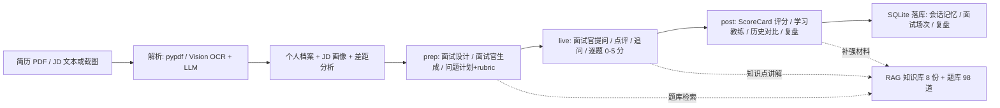

# 📚 AI 面试智能系统 · 项目全解 + 技术栈学习路线

> 本文档一次性回答三个问题：
> 1. 这个项目里**每个文件**是干什么的？
> 2. 用了**哪些技术栈**？每一项具体用在哪里？
> 3. 从零开始怎么学？**B 站看什么课**、按什么顺序、学到什么程度才能把这个项目讲明白？

---

## 一、项目是什么（30 秒版）

**AI 面试智能系统**是一个面向「大模型 / AI 应用开发」第一次实习的多 Agent + RAG 面试陪练应用：

- 绑定你的**个人档案**（简历 PDF 自动解析）+ **目标 JD**（文本或截图 OCR 自动解析）
- 面试官根据你的真实项目和岗位要求**深挖追问**，不是通用聊天
- 面试完给出**评分标准驱动的结构化报告**（0-5 分 + 5 维度）与学习计划
- 面经复盘自动归档成行动清单

核心流程是 **prep（面试前）→ live（面试中）→ post（面试后）** 三段式闭环：

平时还能当"陪练台"用：主管 Agent 路由到**模拟面试官 / 八股讲师 / 求职顾问**三个专员，全程 Function Calling 驱动。

---

## 二、全部文件与作用（逐文件）

> 运行项目后会自动生成 `data/interview.db`（SQLite 数据库）和 `data/rag_index/`（向量索引缓存），这两个不在 git 里，不用管。

### 2.1 根目录

| 文件 | 作用 |
| --- | --- |
| `README.md` | 项目门面：痛点、三段式流程、技术栈亮点、量化指标、快速开始。**面试官第一眼就看它**，也是你面试自我介绍的大纲 |
| `start.command` | macOS 双击一键启动：自动建虚拟环境、装依赖、构建前端、启动服务、等就绪后自动开浏览器；检测到端口占用就直接打开已运行的服务 |
| `.env.example` | 配置模板。复制为 `.env` 后填入 `DEEPSEEK_API_KEY`（也支持自定义 `DEEPSEEK_BASE_URL` / `DEEPSEEK_MODEL` 换其他兼容 OpenAI 协议的大模型） |
| `.gitignore` | 忽略 `.venv`、`node_modules`、`.env`、`__pycache__`、`data/interview.db`、`data/rag_index` 等 |
| `LICENSE` | MIT 协议（借鉴了 DeepInterview / 聆悟的 Apache-2.0 / MIT 设计，代码为本项目重写） |
| `requirements.txt` | 后端基础依赖：FastAPI、Uvicorn、SQLAlchemy、OpenAI SDK、pydantic、pypdf、python-multipart、pytest、jieba、python-dotenv |
| `requirements-rag.txt` | 可选 RAG 增强依赖：sentence-transformers + faiss（装了才启用向量检索；不装自动降级纯关键词） |
| `.github/workflows/ci.yml` | GitHub Actions CI：后端跑 `pytest`，前端跑 `tsc --noEmit + vite build`，push/PR 自动触发 |

### 2.2 `backend/app/` — 业务逻辑核心（纯 Python，不依赖 Web 框架）

| 文件 | 作用 |
| --- | --- |
| `config.py` | 全局配置唯一入口：从 `.env` 读 API Key / Base URL / 模型名，定义数据目录、知识库路径、题库路径、数据库路径；`ensure_dirs()` 自动建目录 |
| `db.py` | SQLite 持久层：SQLAlchemy ORM 定义 `ChatMessage`（会话消息）、`Interview`（面试场次）、`InterviewQA`（逐题问答）、`UserProfile`（个人档案）、`InterviewReview`（复盘）五张表；`get_session()` 提供会话上下文 |
| `llm_utils.py` | LLM 调用容错：`with_retry` 装饰器实现**指数退避重试**（3 次、翻倍等待、上限 8 秒），API 偶发失败不崩 |
| `tools/__init__.py` | 工具注册中心：声明 Agent 可调用的工具（JSON Schema + 实现）——`query_question` 按主题/难度抽题、`query_job` 按城市/方向查岗位、`search_knowledge` 检索知识库。新工具只要在这里加一份声明 + 一个函数就能被 Agent 调用 |
| `profile.py` | 候选人档案：默认档案（目标岗位、技能栈、弱项、3 个真实项目含指标/深挖点）、SQLite 读写、`profile_context_text()` 把档案拼成提示词上下文，驱动个性化出题；`analyze_resume` 类逻辑负责简历解析 |
| `interview.py` | **面试闭环核心（prep/live/post 状态机）**：JD 画像解析、差距分析、面试设计（一句话→完整设计）、问题计划（难度曲线/考察能力/rubric/追问种子）、live 点评追问与逐题 0-5 评分、post ScoreCard 报告、学习教练补强计划、复盘。每环节结构化 JSON，非法 JSON 有正则兜底 |
| `interview_store.py` | 面试场次存储：创建/读取/更新/删除面试与问答记录（SQLite），前端历史页和报告页的数据来源 |
| `review_store.py` | 面经复盘存储：保存/列表/删除复盘结果（摘要、亮点、弱点、要点、行动清单） |
| `chat_history.py` | 会话历史读写：SQLite 落盘，刷新/重启不丢——这就是"AI 记得上下文"的答案 |
| `cards.py` | 轨迹转卡片：把 Agent 工具调用轨迹解析成前端可渲染的卡片（知识卡片 / 题目列表 / 岗位列表） |

### 2.3 `backend/app/agent/` — 手写多 Agent 引擎（项目最大亮点，面试重点讲）

| 文件 | 作用 |
| --- | --- |
| `core.py` | 对外导出统一入口：`MultiAgentHarness`、`AgentLoop`、`AgentError`、`strip_thought` |
| `harness.py` | **主管路由**：`RouterAgent` 单次 LLM 调用判断直接回复还是调 `delegate` 指派专员；`MultiAgentHarness` 统一调度主管 + 三个专员，注入档案上下文与记忆，记录全程轨迹（trace） |
| `loop.py` | **通用 Function Calling 循环引擎**（`AgentLoop`）：多 Agent 共用，提示词/工具/记忆可注入；解析 tool_calls → 执行工具 → 回填结果 → 继续生成，最多 6 轮迭代防死循环；非法工具、参数错误、超限都有明确降级提示。**不依赖 LangGraph，全手写** |
| `roles.py` | 角色定义：主管路由提示词 + 三个专员提示词（interviewer 模拟面试官 / tutor 八股讲师 / career 求职顾问）+ 各自的工具子集和 `delegate` 工具 Schema |
| `memory.py` | 会话记忆：启动时从 SQLite 回填最近 24 条历史，跨轮不"失忆"，只保留 user/assistant 角色 |
| `rag.py` | **RAG 检索**：Markdown 标题感知分块（#/##/###）→ jieba 关键词 + FAISS/m3e 向量 **RRF 混合检索**；索引持久化 + 文档指纹自动重建；无向量依赖自动降级纯关键词；embedding 模型单例缓存 |

### 2.4 `server/` — API 层

| 文件 | 作用 |
| --- | --- |
| `main.py` | FastAPI 全部接口：`/api/chat`（SSE 流式对话）、`/api/profile`（读写档案）、`/api/profile/analyze-jd`（JD 解析）、`/api/resume/parse`（简历 PDF 解析）、`/api/jd/ocr`（JD 图片 OCR）、`/api/interview/*`（启动/答题/点评/评分/报告/历史）、`/api/review/*`（复盘）、`/api/health`；同时静态托管构建好的前端（SPA 回退 index.html） |
| `ocr_vision.swift` | macOS Vision 本机 OCR 脚本（中文+英文），读取 JD 截图图片路径、输出识别文本；不联网、不传图给第三方 |

### 2.5 `web/` — React 前端

| 文件 | 作用 |
| --- | --- |
| `index.html` | Vite 入口 HTML |
| `package.json` | 前端依赖与脚本：React 18、Vite 6、TypeScript、Tailwind 4、lucide-react 图标；`dev` 开发 / `build` 类型检查+构建 |
| `tsconfig.json` | TypeScript 编译配置 |
| `vite.config.ts` | Vite 配置：React 插件 + Tailwind 插件 + 开发代理 |
| `src/main.tsx` | React 挂载入口 |
| `src/App.tsx` | 页面路由中枢：根据当前页 key 渲染 6 个页面之一 |
| `src/index.css` | 全局样式（Tailwind v4 入口） |
| `src/lib/api.ts` | 全部后端 API 封装：统一 fetch + 错误解析 + 类型化返回；含 `StartResult` / `FinishResult` 等接口 |
| `src/lib/types.ts` | 前后端共享的类型定义：Profile、Question、JdAnalysis、Report、Review、ChatMessage 等 |
| `src/components/AppShell.tsx` | 应用外壳：侧边导航（聊天/面试/复盘/作战室/历史/档案）、响应式布局 |
| `src/components/ScoreCard.tsx` | 面试评分卡组件：能力维度分数 + 雷达/条状展示 |
| `src/components/ui.tsx` | 通用 UI 组件（按钮、卡片、输入等） |
| `src/pages/ChatPage.tsx` | 自由对话页：SSE 流式输出 + 工具调用卡片展示（知识/题目/岗位） |
| `src/pages/InterviewPage.tsx` | 模拟面试页：面试官生成 → 逐题作答 → 评分反馈 → 整场报告（prep/live/post 主战场） |
| `src/pages/ReviewPage.tsx` | 复盘页：导入面经/粘贴记录 → 生成复盘 + 行动清单 |
| `src/pages/WarRoomPage.tsx` | 求职作战室：岗位库浏览、规划、进度总览 |
| `src/pages/HistoryPage.tsx` | 历史记录：过往面试场次与报告回看 |
| `src/pages/ProfilePage.tsx` | 我的档案：上传简历 PDF 自动解析、编辑技能栈/项目、粘贴目标 JD 生成画像 |
| `dist/` | Vite 构建产物（已入库，CI 保证最新） |

### 2.6 `data/` — 数据资产（RAG 知识库 + 题库 + 岗位库）

| 文件 | 作用 |
| --- | --- |
| `knowledge/python_basics.md` | Python 八股知识（GIL、装饰器、深浅拷贝等） |
| `knowledge/database.md` | 数据库知识（索引、事务 ACID、隔离级别） |
| `knowledge/network.md` | 计算机网络知识 |
| `knowledge/os.md` | 操作系统知识 |
| `knowledge/ai_agent.md` | AI Agent / 大模型 / RAG 知识 |
| `knowledge/interview_guide.md` | 面试方法论 |
| `knowledge/career_plan.md` | 求职规划 |
| `knowledge/project_deep_dive.md` | 项目深挖方法（技术选型/难点/量化/失败与改进） |
| `packs/ai-application-intern.md` | AI 应用开发实习岗位 playbook：轮次结构 / 题库 / 考察信号 / 常见坑，注入出题提示词 |
| `packs/python-backend-intern.md` | Python 后端实习岗位 playbook |
| `questions.json` | **98 道面试题**（含主题、难度、参考答案），Agent 抽题与题库兜底出题的数据源 |
| `jobs.json` | **16 条实习岗位**样本数据，求职顾问查询用 |

### 2.7 `scripts/` 与 `tests/` — 评估与测试

| 文件 | 作用 |
| --- | --- |
| `scripts/eval_rag.py` | RAG 检索质量评测：14 条 query → 期望来源文档，输出 Recall@K / MRR（实测 0.929 / 0.750）。**离线可跑，不需要 API Key** |
| `scripts/eval_agent.py` | 多 Agent 评测：16 条意图测路由准确率 / 工具准确率 / 回答完整率（实测全 100%）。需要 API Key |
| `scripts/eval_interview.py` | 面试闭环评测：出题/点评追问/评分/复盘结构完整率。需要 API Key |
| `tests/conftest.py` | pytest 公共 fixture |
| `tests/test_harness.py` | 主管路由 / 专员权限 / 记忆注入测试 |
| `tests/test_interview.py` | prep-live-post 面试闭环测试 |
| `tests/test_profile.py` | 档案读写 / 简历解析测试 |
| `tests/test_rag.py` | RAG 分块 / 检索 / 降级测试 |
| `tests/test_review_store.py` | 复盘存储测试 |

### 2.8 `docs/` — 文档

| 文件 | 作用 |
| --- | --- |
| `docs/interview_script.md` | 面试讲解脚本：这个项目怎么讲、会被问什么、怎么答（你的"考前押题"） |
| `docs/superpowers/specs/2026-08-11-ai-interview-agent-revamp-design.md` | 项目改造设计文档（架构演进依据） |
| `docs/superpowers/specs/2026-08-11-prep-live-post-coach-design.md` | 面试三段式闭环 + 学习教练的设计文档 |

---

## 三、技术栈全景

| 技术 | 版本 | 在这个项目里干什么 | 为什么用它 / 面试怎么说 |
| --- | --- | --- | --- |
| Python | 3.13 | 全部后端业务逻辑 | 生态最全（AI/Web/数据），面试实习岗位的默认语言 |
| FastAPI | 最新 | REST + SSE 流式接口层（`server/main.py`） | 原生异步、Pydantic 校验、自动生成文档，配 SSE 适合流式 AI 回复 |
| Uvicorn | — | ASGI 服务器，启动脚本里拉起服务 | FastAPI 官方搭档 |
| SQLAlchemy + SQLite | — | 五张表持久化（会话/面试/问答/档案/复盘） | 零部署的本地数据库 + 成熟 ORM，简历项目够用且能讲清模型层 |
| OpenAI SDK | — | 调用 DeepSeek 兼容接口，Function Calling 声明与解析 | 标准协议：只改 base_url 就能换任何兼容模型，讲"协议无关"是加分点 |
| 手写多 Agent Harness | — | `harness.py` + `loop.py` + `roles.py`：主管路由 + 3 专员 + 通用循环 | **不套 LangChain/LangGraph，能讲清 tool_calls 解析、路由、记忆、容错、轨迹**——这是面试最大亮点 |
| RAG 混合检索 | — | jieba 关键词 + FAISS/m3e 向量 + RRF 融合（`rag.py`） | 关键词保精确、向量保语义，RRF 免调权重；有持久化、指纹重建、自动降级 |
| pypdf | — | 简历 PDF 文本层提取 | 纯 Python 解析 PDF |
| python-multipart | — | 文件上传解析 | FastAPI 上传接口必需 |
| macOS Vision (Swift) | — | `ocr_vision.swift` 本机 OCR JD 截图 | 中英文识别好、本地执行不传图，展示系统能力调用 |
| React | 18 | 前端 SPA（`web/src/`） | 生态最大、组件化清晰，实习岗普遍要求 |
| TypeScript | 5.7 | 前端类型安全，`lib/types.ts` 前后端契约 | CI 里 `tsc --noEmit` 卡类型错误，体现工程素养 |
| Vite | 6 | 构建 + 开发服务器 | 秒级热更新，实习项目标配 |
| Tailwind | 4 | 样式方案 | 快速做出现代 UI，减少手写 CSS |
| lucide-react | — | 图标库 | 轻量美观 |
| SSE | — | `/api/chat` 流式输出 | 对话"打字机"效果，讲前端如何消费流式接口 |
| pytest | — | 23 项自动化测试 | 覆盖路由/权限/记忆/RAG/闭环/档案/复盘/简历解析，CI 自动跑 |
| GitHub Actions | — | `.github/workflows/ci.yml` 双 Job CI | push/PR 自动验证后端测试 + 前端构建，简历上写"CI 全绿" |

**一句话总结技术栈**：Python 写业务与 Agent 引擎，FastAPI 做 API 层，SQLite 做持久化，React + TS 做界面，DeepSeek（OpenAI 协议）做大模型底座，pytest + CI 做质量保障。

---

## 四、核心设计深挖（面试问答素材）

> 面试官最爱从「设计决策」入手深挖。这节把项目里每个值得讲的设计点拆开：它是什么 → 为什么这么设计 → 面试怎么说。和 [docs/interview_script.md](docs/interview_script.md) 配合食用，先看这里建立全局观，再背讲稿。

### 4.1 多 Agent 引擎：为什么手写而不是套 LangGraph

- 是什么：`harness.py` 主管路由 + 3 专员（面试官/八股讲师/求职顾问）+ `loop.py` 通用 Function Calling 循环
- 为什么：学习项目的目标是理解底层——tool_calls 解析、路由、记忆注入、容错、轨迹追踪，套框架就变成"调 API"，讲不出原理
- 面试怎么说：能画出完整调用链路；能说出 LangGraph 解决了什么、代价是什么（黑盒、难调试）；这是**工程取舍能力**的体现

### 4.2 Function Calling 完整链路

1. 模型输出 `tool_calls`（结构化参数）
2. 系统校验参数、执行对应工具（抽题/查岗位/检索知识库）
3. 把工具结果回填给模型
4. 模型基于结果继续生成，直到给出最终回答

细节：最多 6 轮迭代防死循环；非法工具名/参数错误把错误信息回填给模型重新规划；超限返回友好提示。

面试怎么说：能画时序图；能说清"工具调用失败时系统怎么恢复"。

### 4.3 主管路由：为什么需要 RouterAgent

- 是什么：RouterAgent 单次 LLM 调用判断"直接回复"还是调 `delegate` 指派专员
- 为什么：多 Agent 价值在于**职责分离**——提示词更短、出题/讲八股/求职建议互不干扰；加新角色只加一份配置，不需要改路由逻辑
- 实测：16 条意图的路由准确率 100%（`scripts/eval_agent.py`）

### 4.4 RAG：为什么混合检索 + RRF

- 是什么：jieba 关键词 + FAISS/m3e 向量**两路召回**，RRF 融合：`score = Σ 1/(k + rank)`
- 为什么：关键词擅长专有名词/编号精确匹配，向量擅长语义召回（同义改写、口语化表达）；RRF 免调权重，简单可解释
- 工程细节：Markdown 标题感知分块；索引持久化 + 文档指纹重建（文档变了自动重索引）；embedding 模型单例缓存（修过"每次查询重复加载模型"的性能 bug）；无网/未装依赖自动降级纯关键词
- 实测：Recall@3 = **0.929**、MRR = **0.750**（`scripts/eval_rag.py`）

### 4.5 面试闭环状态机 prep / live / post

- 为什么拆三段：面试前**重推理**（JD 画像 → 差距分析 → 面试设计 → 问题计划，每题带难度/能力/rubric/追问种子）；面试中**轻交互**（提问/点评/逐题 0-5 分）；面试后**重推理**（ScoreCard 聚合 5 维度 + 弱能力 + 改进答案 + 学习教练补强计划）
- 设计来源：借鉴 DeepInterview 的三段式与 rubric 评分、聆悟的自然语言面试设计，代码为本项目重写
- 面试怎么说：能讲清每段"重推理/轻交互"的取舍；rubric 让评分从"感觉"变成"可解释"

### 4.6 档案 / JD 驱动的个性化

- 是什么：`profile_context_text()` 把档案摘要拼进面试官/求职顾问的 system prompt；出题时插入约 30% 项目深挖题（技术选型/难点/量化/失败与改进）
- 为什么：通用面试工具没有记忆，绑定档案 + 目标 JD 才有"专属面试官"，也能反哺你梳理自己的简历
- 容错：项目题 LLM 定制失败自动回退模板题，流程不中断

### 4.7 会话记忆

- SQLite 落盘 + 启动时回填最近 24 条历史；刷新/重启不丢
- 面试怎么说：为什么用数据库不用内存（重启不丢）；为什么只回填最近 N 条（控制上下文窗口与成本）；记忆只保留 user/assistant 角色（工具消息不污染对话）

### 4.8 容错与降级（工程素养）

| 场景 | 兜底 |
| --- | --- |
| LLM 偶发失败 | 指数退避重试（3 次、翻倍等待、上限 8 秒，`llm_utils.py`） |
| LLM 返回非法 JSON | 正则兜底提取 → 仍失败回退题库/模板出题 |
| 工具调用失败/参数非法 | 错误信息回填模型重新规划；未知工具返回明确提示 |
| RAG 检索无结果 | 如实告知"知识库未收录"，不编造 |
| 未安装向量检索依赖 | 自动降级 jieba 关键词检索 |
| 未配置 API Key | 界面正常打开，AI 功能给出配置提示 |

面试怎么说：每个降级都能说清"什么场景触发 + 兜底是什么"，这是区分"能用"和"能上线"的分水岭。

### 4.9 简历 PDF 与 JD 截图解析

- 简历：pypdf 提取文本层 + LLM 结构化解析（目标岗位/技能栈/项目经历含量化），自动填进档案
- JD 截图：macOS Vision 本机 OCR（中英文）→ 文本 → LLM 生成岗位画像与差距分析
- 面试怎么说：为什么用本地 OCR 而不是传图给云（隐私 + 展示系统能力调用）；pypdf 只拿文本层，扫描件识别是边界（诚实说明）

### 4.10 前端与 SSE

- React + TypeScript + Tailwind；`/api/chat` 用 SSE 流式输出，前端打字机效果
- 面试怎么说：SSE vs WebSocket 的取舍（单向推送够用、实现简单、自动重连）；TS 类型契约 `lib/types.ts` 让前后端改接口立刻编译报错

### 4.11 测试与评估

- 23 项 pytest：路由/专员权限/记忆/RAG/闭环/档案/复盘/教练/简历解析
- 3 个离线 eval：RAG 指标、Agent 路由与工具准确率、面试闭环完整率
- CI 双 Job：后端 pytest + 前端 tsc/vite build，push/PR 自动跑
- 面试怎么说：指标从哪来（评测集）、怎么复现（脚本）、为什么比"感觉好用"可信

---

## 五、从零开始的 B 站学习路线（核心章节）

> 目标：**10-12 周**从零学到能把这个项目完整讲明白、能应付 AI/大模型实习面试。
> 每阶段都标注了「对照本项目哪个文件」，学完立刻回去读对应代码，学得最快。
> 链接如果失效，直接去 B 站搜括号里的课程名。

### 阶段 0：学前准备（1-2 天）

- 装好 Python 3.12+、VS Code、Node.js 18+、Git，注册 GitHub。
- 把本项目 clone 下来，跑一遍 `start.command` 或手动启动，先"玩熟"这个项目。
- 产出：项目能在本地跑起来，知道"聊天 / 面试 / 复盘 / 档案"四个主页面长什么样。

### 阶段 1：Python 基础（2-3 周）

**课程**：[黑马程序员 Python 600 集（零基础入门到就业）](https://www.bilibili.com/video/BV1ex411x7Em)（搜索：黑马程序员 Python 零基础）

重点看：

1. 基础语法：变量、分支、循环、函数
2. 数据结构：列表、字典、元组、集合、切片、推导式
3. 面向对象：类、继承、魔术方法
4. 文件操作 + JSON：`open()` / `json.loads` / `json.dumps`
5. 异常处理：`try/except`（本项目 LLM 容错的基础）
6. 装饰器 / 生成器（面试高频，读 `llm_utils.py` 里的重试装饰器）
7. 虚拟环境与 pip：`venv` / `pip install`

对照本项目：能读懂 [config.py](/Users/huang/Desktop/个人项目/ai-interview-agent/backend/app/config.py)、[llm_utils.py](/Users/huang/Desktop/个人项目/ai-interview-agent/backend/app/llm_utils.py)、[tools/__init__.py](/Users/huang/Desktop/个人项目/ai-interview-agent/backend/app/tools/__init__.py)。

产出：能独立写一个"读 JSON → 处理 → 写回 JSON"的小脚本；能讲出列表推导、装饰器、深浅拷贝（面试高频）。

### 阶段 2：FastAPI + 数据库（1.5-2 周）

**课程**：[2026 最新版 FastAPI 从入门到实战](https://www.bilibili.com/video/BV1ufgY6MEHJ)（搜索：FastAPI 2026 从入门到实战）；补充：[FastAPI 框架从 0 到 1（路由/依赖注入/Pydantic/ORM/部署）](https://www.bilibili.com/video/BV1cGM96VEUg)；数据库入门：[黑马 MySQL 入门到精通](https://www.bilibili.com/video/BV1Kr4y1i7ru)、[黑马 Redis 入门到精通](https://www.bilibili.com/video/BV1CJ411m7Gc)（进阶部分放到阶段 10）

重点看：

1. 路由：GET/POST/PUT/DELETE 与路径参数
2. Pydantic 请求体校验（本项目所有接口都走它）
3. 文件上传（`UploadFile`，简历 PDF 解析的入口）
4. SQLAlchemy ORM：建表、增删改查、外键（本项目五张表）
5. 数据库设计：主键/外键/唯一约束、一对多关系
6. MySQL 基础：建库建表、为什么索引快（B+ 树入门）
7. Redis 基础：五种数据类型、TTL 过期
8. 静态文件托管 + SPA 回退（本项目前端就由后端托管）

对照本项目：[server/main.py](/Users/huang/Desktop/个人项目/ai-interview-agent/server/main.py)（所有 API）、[backend/app/db.py](/Users/huang/Desktop/个人项目/ai-interview-agent/backend/app/db.py)、[backend/app/interview_store.py](/Users/huang/Desktop/个人项目/ai-interview-agent/backend/app/interview_store.py)。

产出：能用 FastAPI 写一个带 SQLite 存储的增删改查接口；能说清"为什么拆成多张表、为什么建索引"。

### 阶段 3：前端 React + TypeScript（2 周）

**课程**：[尚硅谷 React 教程（B 站最火）](https://www.bilibili.com/video/BV1wy4y1D7JT)（搜索：尚硅谷 React 教程）；补充：[尚硅谷 TypeScript](https://www.bilibili.com/video/BV1Xy4y1v7S2)、[Vite.js 快速入门到精通](https://www.bilibili.com/video/BV13arYYxEGF)

重点看（旧 class 组件部分可快进）：

1. JSX 与组件
2. **Hooks**：useState / useEffect / useRef / useCallback——本项目前端几乎全是 Hooks
3. 状态提升与组件通信
4. fetch 调用后端 API
5. TypeScript：接口类型、泛型（本项目 `lib/types.ts` 是前后端契约）
6. Vite：`dev` 与 `build` 的区别、开发代理

对照本项目：[web/src/pages/ChatPage.tsx](/Users/huang/Desktop/个人项目/ai-interview-agent/web/src/pages/ChatPage.tsx)（SSE 流式）、[web/src/lib/api.ts](/Users/huang/Desktop/个人项目/ai-interview-agent/web/src/lib/api.ts)、[web/src/lib/types.ts](/Users/huang/Desktop/个人项目/ai-interview-agent/web/src/lib/types.ts)、[web/src/App.tsx](/Users/huang/Desktop/个人项目/ai-interview-agent/web/src/App.tsx)。

产出：能自己写一个"列表页 + 表单页 + 调后端接口"的小页面；知道 tsc 类型检查为什么能提前拦错。

### 阶段 4：大模型原理（1 周）

**课程**：[李宏毅《生成式人工智能导论》](https://www.bilibili.com/video/BV1kUoKBAESK)（搜索：李宏毅 生成式人工智能导论）；补充：[3Blue1Brown 深度学习之神经网络](https://www.bilibili.com/video/BV1bx411M7Zx)、[李宏毅 一次性搞定 Transformer](https://www.bilibili.com/video/BV1i85M6REL9)

重点看：

1. 生成式 AI 是怎么工作的（下一 token 预测）
2. 神经网络结构、梯度下降、反向传播（3Blue1Brown，理解"模型在学什么"）
3. **上下文工程（Context Engineering）**：把档案/JD/知识塞进提示词的原理——本项目核心
4. Transformer 与自注意力机制（为什么模型能"记住"长上下文）
5. Embedding 是什么（向量检索的地基，阶段 8 会用到）

对照本项目：[backend/app/agent/roles.py](/Users/huang/Desktop/个人项目/ai-interview-agent/backend/app/agent/roles.py)（系统提示词设计）、[backend/app/profile.py](/Users/huang/Desktop/个人项目/ai-interview-agent/backend/app/profile.py)（档案注入提示词）、[backend/app/interview.py](/Users/huang/Desktop/个人项目/ai-interview-agent/backend/app/interview.py)（rubric 评分）。

产出：能解释"为什么面试官记得你的项目"（档案被拼进 system prompt）；能解释上下文窗口、temperature、embedding 是什么。

### 阶段 5：Prompt 工程（3-5 天）

**课程**：[吴恩达《ChatGPT Prompt Engineering for Developers》中文精讲](https://www.bilibili.com/video/BV1Bo4y1A7FU)（搜索：吴恩达 Prompt Engineering）

重点看：

1. 写清晰指令：分隔符、结构化输出、条件
2. Few-shot：给模型示例再让它干活
3. 让模型先思考再回答（Chain of Thought）
4. 迭代优化：好 prompt 是改出来的，不是一次写出来的
5. 防幻觉：明确"不知道就说不知道"（本项目知识库兜底就是这个思路）

对照本项目：逐行读 [roles.py](/Users/huang/Desktop/个人项目/ai-interview-agent/backend/app/agent/roles.py) 里的面试官 / 八股讲师 / 求职顾问三套 system prompt，试着改写其中一套。

产出：能把一个模糊需求写成带格式约束、few-shot 示例的系统提示词；能说清 system / user / assistant 三段式分工。

### 阶段 6：SSE 流式 + Web 工程（3-5 天）

**课程**：[SSE（Server-Sent Events）原理与应用场景 + 打字机流式输出 Demo](https://www.bilibili.com/video/BV1La6uB9EoL)（搜索：SSE 打字机 流式输出）

重点看：

1. SSE 是什么、和 WebSocket 的区别
2. 后端怎么往一条连接里不断推数据
3. 前端 `EventSource` / fetch 流式读取
4. 打字机效果怎么实现、中断怎么处理

对照本项目：后端 [server/main.py](/Users/huang/Desktop/个人项目/ai-interview-agent/server/main.py) 的 `/api/chat` 流式接口 + 前端 [ChatPage.tsx](/Users/huang/Desktop/个人项目/ai-interview-agent/web/src/pages/ChatPage.tsx) 的流式消费。

产出：能讲清"为什么 AI 回复要流式输出"；能自己写一个 SSE 小 Demo。

### 阶段 7：AI Agent 与 Function Calling（1-1.5 周）

**课程**：[李宏毅 AI Agent 系列课程](https://www.bilibili.com/video/BV1MJLF6sEQF)（搜索：李宏毅 AI Agent）；进阶：[黑马程序员 LangChain + LangGraph 开发实战](https://www.bilibili.com/video/BV178w1z7EHQ)（Agent 部分）

重点看：

1. Agent 的原理：LLM 决定调用什么工具
2. **Function Calling / Tool Use**：模型输出结构化调用、系统执行、结果回填
3. 工具调用失败怎么处理（错误回填 → 重新规划——本项目就是这么做的）
4. Agent 之间的协作（多 Agent 路由：主管 + 专员）
5. 评测 Agent：不是看单次回复，而是看任务完成率

对照本项目：[backend/app/agent/harness.py](/Users/huang/Desktop/个人项目/ai-interview-agent/backend/app/agent/harness.py)（主管路由）、[backend/app/agent/loop.py](/Users/huang/Desktop/个人项目/ai-interview-agent/backend/app/agent/loop.py)（Function Calling 循环）、[backend/app/tools/__init__.py](/Users/huang/Desktop/个人项目/ai-interview-agent/backend/app/tools/__init__.py)、[scripts/eval_agent.py](/Users/huang/Desktop/个人项目/ai-interview-agent/scripts/eval_agent.py)。

产出：能讲清"一次工具调用从模型出参到回填结果的完整链路"；能说出本项目为什么手写 loop 而不是套 LangGraph。

### 阶段 8：RAG + 向量检索（1-2 周）

**课程**：[《Faiss》基础到进阶（索引加速/内存压缩）](https://www.bilibili.com/video/BV1nx421m7kJ)（搜索：Faiss 向量检索）；RAG 全流程：[黑马程序员 2026 LangChain + LangGraph 开发实战](https://www.bilibili.com/video/BV178w1z7EHQ)（RAG 部分）

重点看：

1. RAG 全流程：切块 → 向量化 → 检索 → 生成
2. 切块策略：按标题 / 固定长度 / 重叠
3. Embedding 与向量检索；FAISS 索引（IVF、HNSW 知道概念即可）
4. 向量检索 vs 关键词检索，**混合检索（RRF 融合）**
5. 评估：Recall@K / MRR（本项目实测指标就是这么来的）
6. LangChain 讲完概念后，**回来看本项目手写版**，理解框架背后的原理

对照本项目：[backend/app/agent/rag.py](/Users/huang/Desktop/个人项目/ai-interview-agent/backend/app/agent/rag.py)（手写 RAG）、[data/knowledge/](/Users/huang/Desktop/个人项目/ai-interview-agent/data/knowledge)（知识库）、[scripts/eval_rag.py](/Users/huang/Desktop/个人项目/ai-interview-agent/scripts/eval_rag.py)。

产出：能讲清"为什么用 RAG 而不是把全部知识塞进提示词"（成本/幻觉/更新）；能解释 RRF 怎么融合两个检索结果。

### 阶段 9：工程化 + CI（1 周）

**不用看长课，按下面顺序看对应章节即可**：

- pytest：[pytest 测试框架入门](https://www.bilibili.com/video/BV18K411m7FH)，重点看 fixture、断言、参数化，然后读懂 [tests/](/Users/huang/Desktop/个人项目/ai-interview-agent/tests) 里 5 个测试文件
- Git：[尚硅谷 Git 入门到精通](https://www.bilibili.com/video/BV1vy4y1s7k6)，会 add/commit/push/分支/冲突解决
- GitHub Actions：[GitHub Actions 从入门到专业人士](https://www.bilibili.com/video/BV1dMCsBKEyk)，看懂 [ci.yml](/Users/huang/Desktop/个人项目/ai-interview-agent/.github/workflows/ci.yml) 的双 Job 在跑什么
- 可选：[黑马 Linux 快速入门](https://www.bilibili.com/video/BV1n84y1i7td)（命令、权限、进程——部署和面试都会用到）
- 把 [docs/interview_script.md](/Users/huang/Desktop/个人项目/ai-interview-agent/docs/interview_script.md) 背熟，它就是你的"面试押题本"

产出：能跑 `pytest -q` 看 23 项全绿；能说出 CI 在跑什么；能按 STAR 把项目讲 3 分钟。

### 阶段 10：面试理论补强（长期，投简历前 2 周集中）

> 这一阶段不是看一门课，而是按"高频八股"补齐短板。时间紧就只刷标 ★ 的。

- 计算机网络：[王道考研 计算机网络](https://www.bilibili.com/video/BV19E411D78Q) ★ —— 三次握手/四次挥手、HTTP/HTTPS、状态码、TCP vs UDP
- 操作系统：[王道考研 操作系统](https://www.bilibili.com/video/BV1YE411D7nH) ★ —— 进程与线程、死锁、内存分页、虚拟内存
- 数据结构：[王道考研 数据结构](https://www.bilibili.com/video/BV1b7411N798) ★ —— 链表/栈/队列/哈希/树/排序/二分（算法题基础）
- MySQL 进阶：[黑马 MySQL](https://www.bilibili.com/video/BV1Kr4y1i7ru) 进阶篇 —— 索引 B+ 树、执行计划、事务隔离级别
- Redis 原理：[黑马 Redis](https://www.bilibili.com/video/BV1CJ411m7Gc) —— 缓存穿透/击穿/雪崩、过期策略（本项目缓存降级就是实际应用）
- JavaScript 进阶：[尚硅谷 JS 高级](https://www.bilibili.com/video/BV14s411E7qf) —— 事件循环、闭包、原型链（前端岗常问）
- 大模型面试八股：回看阶段 4/5/7/8 的课程目录，把"上下文窗口、温度、Function Calling、RAG、幻觉"各写一段自己的话

产出：能对着 [docs/interview_script.md](/Users/huang/Desktop/个人项目/ai-interview-agent/docs/interview_script.md) 的每一问口述 1 分钟；面经里出现的技术名词没有一个是陌生的。

### 路线总览（10-12 周）

| 阶段 | 时长 | 课程 | 对照本项目 |
| --- | --- | --- | --- |
| 0 学前准备 | 1-2 天 | 跑通项目 | 整个项目 |
| 1 Python 基础 | 2-3 周 | 黑马 Python 600 集（BV1ex411x7Em） | config / llm_utils / tools |
| 2 FastAPI + 数据库 | 1.5-2 周 | FastAPI 2026（BV1ufgY6MEHJ）+ MySQL/Redis 入门 | server/main.py / db.py / interview_store.py |
| 3 React + TS | 2 周 | 尚硅谷 React（BV1wy4y1D7JT）+ TS（BV1Xy4y1v7S2） | web/src 全部 |
| 4 大模型原理 | 1 周 | 李宏毅生成式 AI（BV1kUoKBAESK）+ 3Blue1Brown + Transformer | roles / profile / interview |
| 5 Prompt 工程 | 3-5 天 | 吴恩达 Prompt Engineering（BV1Bo4y1A7FU） | roles.py 三套 system prompt |
| 6 SSE 流式 | 3-5 天 | SSE 原理与应用（BV1La6uB9EoL） | chat 接口 + ChatPage |
| 7 Agent | 1-1.5 周 | 李宏毅 AI Agent（BV1MJLF6sEQF）+ LangChain Agent 部分 | harness / loop / tools |
| 8 RAG | 1-2 周 | Faiss（BV1nx421m7kJ）+ LangChain RAG 部分 | rag.py / knowledge / eval_rag |
| 9 工程化 + CI | 1 周 | pytest（BV18K411m7FH）/ Git / Actions | tests / ci.yml / interview_script |
| 10 八股补强 | 长期 | 王道计网（BV19E411D78Q）/ 王道 OS（BV1YE411D7nH）/ 数据结构（BV1b7411N798） | 面试前两周集中刷 |

---

## 六、整体时间规划

| 周次 | 学习内容 | 产出 |
| --- | --- | --- |
| 第 1 周 | 阶段 0 + 阶段 1 前半 | 环境就绪，项目跑通，能读懂 config / llm_utils |
| 第 2-3 周 | 阶段 1 后半 + 阶段 2 前半 | 能写 Python 脚本、FastAPI 接口，知道五张表怎么来的 |
| 第 4-5 周 | 阶段 2 后半 + 阶段 3 | 能讲清数据库设计与索引；会写 React + TS 页面 |
| 第 6 周 | 阶段 4 + 5 | 能解释上下文工程、embedding、system prompt 怎么写 |
| 第 7 周 | 阶段 6 + 7 | 能讲清 SSE 流式与 Function Calling 完整链路 |
| 第 8-9 周 | 阶段 8 | 能讲 RAG 原理、RRF 融合，并复现 Recall@K / MRR 指标 |
| 第 10 周 | 阶段 9 | pytest 23 项全绿、看懂 CI 双 Job、能按 STAR 讲 3 分钟 |
| 第 11-12 周 | 阶段 10 + 模拟面试 | 八股每题口述 1 分钟，模拟面试 3 场以上 |

> 时间紧的版本：跳过阶段 6（SSE 讲概念即可）、阶段 9 只跑一遍 pytest，压缩到 8 周。

---

## 七、面试要点速查（技术点 → 一句话答案）

| 技术点 | 一句话回答 |
| --- | --- |
| 为什么手写 Agent 不用 LangGraph | 学习项目要理解底层：tool_calls 解析、路由、记忆、容错都能自己讲清；框架是工程权衡，不是必须 |
| Function Calling 一次调用怎么走 | 模型出 tool_calls → 校验 → 执行工具 → 结果回填 → 再生成，最多 6 轮防死循环 |
| 多 Agent 为什么要有主管 | 单轮 LLM 判断"直接答还是派专员"，职责分离、提示词短、加角色只加配置 |
| RAG 为什么混合检索 | 关键词保精确（专有名词/编号），向量保语义（同义改写）；RRF 融合免调权重 |
| RRF 怎么融合 | 两路结果按排名打分 `score = Σ 1/(k+rank)`，合并排序取 Top-K |
| Recall@K / MRR 是什么 | Recall@3=正确答案是否进前 3；MRR=第一个正确答案排名的倒数均值 |
| 为什么用 RAG 不把知识塞提示词 | 成本、幻觉、更新：知识库独立更新，不用改提示词 |
| 档案怎么让面试官"认识我" | 档案摘要拼进 system prompt，出题注入约 30% 项目深挖题 |
| 会话记忆怎么不丢 | SQLite 落盘 + 启动回填最近 24 条，刷新/重启不丢 |
| LLM 返回非法 JSON 怎么办 | 正则兜底提取；仍失败回退题库/模板，流程不中断 |
| 为什么用 SSE 不用轮询/WebSocket | 服务端单向推送、一条长连接、打字机效果；实现简单且够用 |
| 简历 PDF 怎么解析 | pypdf 提文本层 + LLM 结构化解析成档案字段 |
| JD 截图怎么识别 | macOS Vision 本机 OCR（中英文），不传图给第三方 |
| 怎么防止 AI 编造 | RAG 检索不到就如实说"知识库未收录"，降级不硬编 |
| 项目怎么量化 | 23 项 pytest + Recall@3=0.929 / MRR=0.750 + 路由准确率 100%，都有评测集可复现 |
| CI 在跑什么 | 后端 pytest + 前端 tsc/vite build，坏代码到不了 main |
| 如果给你一个月加什么 | 语音面试（ASR/TTS）、多轮追问树、并发压测——能说出方案即可 |

---

## 八、学习方法建议

1. **每学完一个知识点，打开项目对应文件看一遍**：本路线每阶段都标了「对照本项目」，用"注释里写了什么"检验自己懂没懂
2. **先跑起来再深入**：双击 `start.command`，功能 → 代码 → 原理，别对着文档硬啃
3. **面试准备**：对着第七章速查表口述，讲不出来就回看对应阶段的视频章节
4. **进阶加分**：二期功能（语音面试、多轮追问树、并发压测）任做一个都能写进简历

---

## 九、学完自测：面试官会问的 10 个问题

学完上面路线后，你能不看书回答以下问题，就说明这个项目真正属于你了：

1. 这个项目解决什么问题？用户痛点是什么？
2. 为什么用多 Agent 而不是一个 Prompt 全搞定？（职责分离、提示词变短、可扩展）
3. 主管 Agent 怎么决定把任务派给哪个专员？（Function Calling 的 `delegate` 工具）
4. 一次工具调用的完整链路是什么？（模型出 tool_calls → 执行 → 回填 → 再生成）
5. Agent 调用工具出错或返回非法 JSON 怎么办？（错误回填重规划、正则兜底、题库降级）
6. 为什么用 RAG？检索不到怎么办？（知识注入 vs 提示词塞满；如实告知不编造）
7. 关键词检索和向量检索各有什么优缺点？RRF 为什么能融合它们？
8. 怎么保证面试官记得我的项目和简历？（档案/JD 注入 system prompt + SQLite 会话记忆）
9. 怎么评估这个项目？（pytest 23 项 + Recall@K/MRR + 路由准确率——都有实测数字）
10. 如果给你一个月，你想加什么功能？（如：语音面试、多轮追问树、并发压测——能说出方案即可）

---

## 十、一句话简历（背下来）

> **AI 面试智能系统**：面向大模型应用实习岗的多 Agent + RAG 面试陪练应用。手写主管路由 + 三专员 Function Calling 引擎（不依赖 LangGraph），简历 PDF 与 JD 截图自动解析生成专属面试官；prep/live/post 面试闭环含 rubric 评分、ScoreCard 报告与学习教练；RAG 采用关键词 + 向量 RRF 混合检索，实测 Recall@3 = 0.929、MRR = 0.750，路由准确率 100%，23 项 pytest + GitHub Actions CI 全绿。
