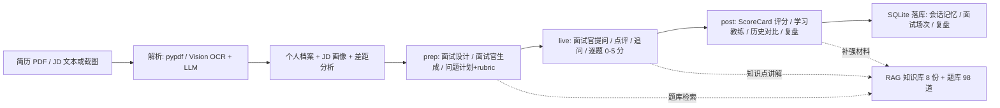

# 📖 AI 面试智能系统 · 说明文档

> 本文件是本项目**全部技术说明的合集**（README 之外的完整文档），按顺序阅读即可：
>
> - **第一部分 · 项目全解**：项目是什么、每个文件的用途、技术栈全景、核心设计深挖（面试问答素材）、B 站学习路线、时间规划、面试速查、自测题、一句话简历
> - **第二部分 · 面试讲稿**：给面试官讲的 STAR 话术、技术决策问答、踩坑故事、反问与常见追问应对
> - **第三部分 · 架构设计文档**：多 Agent 引擎与 prep/live/post 闭环的设计依据（历史设计稿，部分数据与当前实现有出入，以第一部分与当前代码为准）

---

## 第一部分：项目全解

> 本文档一次性回答三个问题：
> 1. 这个项目里**每个文件**是干什么的？
> 2. 用了**哪些技术栈**？每一项具体用在哪里？
> 3. 从零开始怎么学？**B 站看什么课**、按什么顺序、学到什么程度才能把这个项目讲明白？

---

### 一、项目是什么（30 秒版）

**AI 面试智能系统**是一个面向「大模型 / AI 应用开发」第一次实习的多 Agent + RAG 面试陪练应用：

- 绑定你的**个人档案**（简历 PDF 自动解析）+ **目标 JD**（文本或截图 OCR 自动解析）
- 面试官根据你的真实项目和岗位要求**深挖追问**，不是通用聊天
- 面试完给出**评分标准驱动的结构化报告**（0-5 分 + 5 维度）与学习计划
- 面经复盘自动归档成行动清单

核心流程是 **prep（面试前）→ live（面试中）→ post（面试后）** 三段式闭环：

平时还能当"陪练台"用：主管 Agent 路由到**模拟面试官 / 八股讲师 / 求职顾问**三个专员，全程 Function Calling 驱动。

---

### 二、全部文件与作用（逐文件）

> 运行项目后会自动生成 `data/interview.db`（SQLite 数据库）和 `data/rag_index/`（向量索引缓存），这两个不在 git 里，不用管。

#### 2.1 根目录

| 文件 | 作用 |
| --- | --- |
| `README.md` | 项目门面：痛点、三段式流程、技术栈亮点、量化指标、快速开始。**面试官第一眼就看它**，也是你面试自我介绍的大纲 |
| `start.command` | macOS 双击一键启动：自动建虚拟环境、装依赖、构建前端、启动服务、等就绪后自动开浏览器；检测到端口占用就直接打开已运行的服务 |
| `.env.example` | 配置模板。复制为 `.env` 后填入 `DEEPSEEK_API_KEY`（也支持自定义 `DEEPSEEK_BASE_URL` / `DEEPSEEK_MODEL` 换其他兼容 OpenAI 协议的大模型） |
| `.gitignore` | 忽略 `.venv`、`node_modules`、`.env`、`__pycache__`、`data/interview.db`、`data/rag_index` 等 |
| `LICENSE` | MIT 协议（借鉴了 DeepInterview / 聆悟的 Apache-2.0 / MIT 设计，代码为本项目重写） |
| `requirements.txt` | 后端基础依赖：FastAPI、Uvicorn、SQLAlchemy、OpenAI SDK、pydantic、pypdf、python-multipart、pytest、jieba、python-dotenv |
| `requirements-rag.txt` | 可选 RAG 增强依赖：sentence-transformers + faiss（装了才启用向量检索；不装自动降级纯关键词） |
| `.github/workflows/ci.yml` | GitHub Actions CI：后端跑 `pytest`，前端跑 `tsc --noEmit + vite build`，push/PR 自动触发 |

#### 2.2 `backend/app/` — 业务逻辑核心（纯 Python，不依赖 Web 框架）

| 文件 | 作用 |
| --- | --- |
| `config.py` | 全局配置唯一入口：从 `.env` 读 API Key / Base URL / 模型名，定义数据目录、知识库路径、题库路径、数据库路径；`ensure_dirs()` 自动建目录 |
| `db.py` | SQLite 持久层：SQLAlchemy ORM 定义 `ChatMessage`（会话消息）、`Interview`（面试场次）、`InterviewQA`（逐题问答）、`UserProfile`（个人档案）、`InterviewReview`（复盘）五张表；`get_session()` 提供会话上下文 |
| `llm_utils.py` | LLM 调用容错：`with_retry` 装饰器实现**指数退避重试**（3 次、翻倍等待、上限 8 秒），API 偶发失败不崩 |
| `tools/__init__.py` | 工具注册中心：声明 Agent 可调用的工具（JSON Schema + 实现）——`query_question` 按主题/难度抽题、`query_job` 按城市/方向查岗位、`search_knowledge` 检索知识库。新工具只要在这里加一份声明 + 一个函数就能被 Agent 调用 |
| `profile.py` | 候选人档案：默认档案（目标岗位、技能栈、弱项、3 个真实项目含指标/深挖点）、SQLite 读写、`profile_context_text()` 把档案拼成提示词上下文，驱动个性化出题；`analyze_resume` 类逻辑负责简历解析 |
| `interview.py` | **面试闭环核心（prep/live/post 状态机）**：JD 画像解析、差距分析、面试设计（一句话→完整设计）、问题计划（难度曲线/考察能力/rubric/追问种子）、live 点评追问与逐题 0-5 评分、post ScoreCard 报告、学习教练补强计划、复盘。每环节结构化 JSON，非法 JSON 有正则兜底 |
| `interview_store.py` | 面试场次存储：创建/读取/更新/删除面试与问答记录（SQLite），前端历史页和报告页的数据来源 |
| `review_store.py` | 面经复盘存储：保存/列表/删除复盘结果（摘要、亮点、弱点、要点、行动清单） |
| `chat_history.py` | 会话历史读写：SQLite 落盘，刷新/重启不丢——这就是"AI 记得上下文"的答案 |
| `cards.py` | 轨迹转卡片：把 Agent 工具调用轨迹解析成前端可渲染的卡片（知识卡片 / 题目列表 / 岗位列表） |

#### 2.3 `backend/app/agent/` — 手写多 Agent 引擎（项目最大亮点，面试重点讲）

| 文件 | 作用 |
| --- | --- |
| `core.py` | 对外导出统一入口：`MultiAgentHarness`、`AgentLoop`、`AgentError`、`strip_thought` |
| `harness.py` | **主管路由**：`RouterAgent` 单次 LLM 调用判断直接回复还是调 `delegate` 指派专员；`MultiAgentHarness` 统一调度主管 + 三个专员，注入档案上下文与记忆，记录全程轨迹（trace） |
| `loop.py` | **通用 Function Calling 循环引擎**（`AgentLoop`）：多 Agent 共用，提示词/工具/记忆可注入；解析 tool_calls → 执行工具 → 回填结果 → 继续生成，最多 6 轮迭代防死循环；非法工具、参数错误、超限都有明确降级提示。**不依赖 LangGraph，全手写** |
| `roles.py` | 角色定义：主管路由提示词 + 三个专员提示词（interviewer 模拟面试官 / tutor 八股讲师 / career 求职顾问）+ 各自的工具子集和 `delegate` 工具 Schema |
| `memory.py` | 会话记忆：启动时从 SQLite 回填最近 24 条历史，跨轮不"失忆"，只保留 user/assistant 角色 |
| `rag.py` | **RAG 检索**：Markdown 标题感知分块（#/##/###）→ jieba 关键词 + FAISS/m3e 向量 **RRF 混合检索**；索引持久化 + 文档指纹自动重建；无向量依赖自动降级纯关键词；embedding 模型单例缓存 |

#### 2.4 `server/` — API 层

| 文件 | 作用 |
| --- | --- |
| `main.py` | FastAPI 全部接口：`/api/chat`（SSE 流式对话）、`/api/profile`（读写档案）、`/api/profile/analyze-jd`（JD 解析）、`/api/resume/parse`（简历 PDF 解析）、`/api/jd/ocr`（JD 图片 OCR）、`/api/interview/*`（启动/答题/点评/评分/报告/历史）、`/api/review/*`（复盘）、`/api/health`；同时静态托管构建好的前端（SPA 回退 index.html） |
| `ocr_vision.swift` | macOS Vision 本机 OCR 脚本（中文+英文），读取 JD 截图图片路径、输出识别文本；不联网、不传图给第三方 |

#### 2.5 `web/` — React 前端

| 文件 | 作用 |
| --- | --- |
| `index.html` | Vite 入口 HTML |
| `package.json` | 前端依赖与脚本：React 18、Vite 6、TypeScript、Tailwind 4、lucide-react 图标；`dev` 开发 / `build` 类型检查+构建 |
| `tsconfig.json` | TypeScript 编译配置 |
| `vite.config.ts` | Vite 配置：React 插件 + Tailwind 插件 + 开发代理 |
| `src/main.tsx` | React 挂载入口 |
| `src/App.tsx` | 页面路由中枢：根据当前页 key 渲染 6 个页面之一 |
| `src/index.css` | 全局样式（Tailwind v4 入口） |
| `src/lib/api.ts` | 全部后端 API 封装：统一 fetch + 错误解析 + 类型化返回；含 `StartResult` / `FinishResult` 等接口 |
| `src/lib/types.ts` | 前后端共享的类型定义：Profile、Question、JdAnalysis、Report、Review、ChatMessage 等 |
| `src/components/AppShell.tsx` | 应用外壳：侧边导航（聊天/面试/复盘/作战室/历史/档案）、响应式布局 |
| `src/components/ScoreCard.tsx` | 面试评分卡组件：能力维度分数 + 雷达/条状展示 |
| `src/components/ui.tsx` | 通用 UI 组件（按钮、卡片、输入等） |
| `src/pages/ChatPage.tsx` | 自由对话页：SSE 流式输出 + 工具调用卡片展示（知识/题目/岗位） |
| `src/pages/InterviewPage.tsx` | 模拟面试页：面试官生成 → 逐题作答 → 评分反馈 → 整场报告（prep/live/post 主战场） |
| `src/pages/ReviewPage.tsx` | 复盘页：导入面经/粘贴记录 → 生成复盘 + 行动清单 |
| `src/pages/WarRoomPage.tsx` | 求职作战室：岗位库浏览、规划、进度总览 |
| `src/pages/HistoryPage.tsx` | 历史记录：过往面试场次与报告回看 |
| `src/pages/ProfilePage.tsx` | 我的档案：上传简历 PDF 自动解析、编辑技能栈/项目、粘贴目标 JD 生成画像 |
| `dist/` | Vite 构建产物（已入库，CI 保证最新） |

#### 2.6 `data/` — 数据资产（RAG 知识库 + 题库 + 岗位库）

| 文件 | 作用 |
| --- | --- |
| `knowledge/python_basics.md` | Python 八股知识（GIL、装饰器、深浅拷贝等） |
| `knowledge/database.md` | 数据库知识（索引、事务 ACID、隔离级别） |
| `knowledge/network.md` | 计算机网络知识 |
| `knowledge/os.md` | 操作系统知识 |
| `knowledge/ai_agent.md` | AI Agent / 大模型 / RAG 知识 |
| `knowledge/interview_guide.md` | 面试方法论 |
| `knowledge/career_plan.md` | 求职规划 |
| `knowledge/project_deep_dive.md` | 项目深挖方法（技术选型/难点/量化/失败与改进） |
| `packs/ai-application-intern.md` | AI 应用开发实习岗位 playbook：轮次结构 / 题库 / 考察信号 / 常见坑，注入出题提示词 |
| `packs/python-backend-intern.md` | Python 后端实习岗位 playbook |
| `questions.json` | **98 道面试题**（含主题、难度、参考答案），Agent 抽题与题库兜底出题的数据源 |
| `jobs.json` | **16 条实习岗位**样本数据，求职顾问查询用 |

#### 2.7 `scripts/` 与 `tests/` — 评估与测试

| 文件 | 作用 |
| --- | --- |
| `scripts/eval_rag.py` | RAG 检索质量评测：14 条 query → 期望来源文档，输出 Recall@K / MRR（实测 0.929 / 0.750）。**离线可跑，不需要 API Key** |
| `scripts/eval_agent.py` | 多 Agent 评测：16 条意图测路由准确率 / 工具准确率 / 回答完整率（实测全 100%）。需要 API Key |
| `scripts/eval_interview.py` | 面试闭环评测：出题/点评追问/评分/复盘结构完整率。需要 API Key |
| `tests/conftest.py` | pytest 公共 fixture |
| `tests/test_harness.py` | 主管路由 / 专员权限 / 记忆注入测试 |
| `tests/test_interview.py` | prep-live-post 面试闭环测试 |
| `tests/test_profile.py` | 档案读写 / 简历解析测试 |
| `tests/test_rag.py` | RAG 分块 / 检索 / 降级测试 |
| `tests/test_review_store.py` | 复盘存储测试 |

#### 2.8 `说明文档.md`（本文档）— 全部技术说明

| 文件 | 作用 |
| --- | --- |
| 第一部分「项目全解」 | 逐文件用途、技术栈全景、核心设计深挖、B 站学习路线、时间规划、面试速查、自测 |
| 第二部分「面试讲稿」 | 面试讲解脚本：这个项目怎么讲、会被问什么、怎么答（你的"考前押题"） |
| 第三部分 3.1「多 Agent 引擎与面试闭环改造设计」 | 项目改造设计文档（架构演进依据，含设计背景与取舍） |
| 第三部分 3.2「prep/live/post 闭环与学习教练设计」 | 面试三段式闭环 + 学习教练的设计文档 |

---

### 三、技术栈全景

| 技术 | 版本 | 在这个项目里干什么 | 为什么用它 / 面试怎么说 |
| --- | --- | --- | --- |
| Python | 3.13 | 全部后端业务逻辑 | 生态最全（AI/Web/数据），面试实习岗位的默认语言 |
| FastAPI | 最新 | REST + SSE 流式接口层（`server/main.py`） | 原生异步、Pydantic 校验、自动生成文档，配 SSE 适合流式 AI 回复 |
| Uvicorn | — | ASGI 服务器，启动脚本里拉起服务 | FastAPI 官方搭档 |
| SQLAlchemy + SQLite | — | 五张表持久化（会话/面试/问答/档案/复盘） | 零部署的本地数据库 + 成熟 ORM，简历项目够用且能讲清模型层 |
| OpenAI SDK | — | 调用 DeepSeek 兼容接口，Function Calling 声明与解析 | 标准协议：只改 base_url 就能换任何兼容模型，讲"协议无关"是加分点 |
| 手写多 Agent Harness | — | `harness.py` + `loop.py` + `roles.py`：主管路由 + 3 专员 + 通用循环 | **不套 LangChain/LangGraph，能讲清 tool_calls 解析、路由、记忆、容错、轨迹**——这是面试最大亮点 |
| RAG 混合检索 | — | jieba 关键词 + FAISS/m3e 向量 + RRF 融合（`rag.py`） | 关键词保精确、向量保语义，RRF 免调权重；有持久化、指纹重建、自动降级 |
| pypdf | — | 简历 PDF 文本层提取 | 纯 Python 解析 PDF |
| python-multipart | — | 文件上传解析 | FastAPI 上传接口必需 |
| macOS Vision (Swift) | — | `ocr_vision.swift` 本机 OCR JD 截图 | 中英文识别好、本地执行不传图，展示系统能力调用 |
| React | 18 | 前端 SPA（`web/src/`） | 生态最大、组件化清晰，实习岗普遍要求 |
| TypeScript | 5.7 | 前端类型安全，`lib/types.ts` 前后端契约 | CI 里 `tsc --noEmit` 卡类型错误，体现工程素养 |
| Vite | 6 | 构建 + 开发服务器 | 秒级热更新，实习项目标配 |
| Tailwind | 4 | 样式方案 | 快速做出现代 UI，减少手写 CSS |
| lucide-react | — | 图标库 | 轻量美观 |
| SSE | — | `/api/chat` 流式输出 | 对话"打字机"效果，讲前端如何消费流式接口 |
| pytest | — | 23 项自动化测试 | 覆盖路由/权限/记忆/RAG/闭环/档案/复盘/简历解析，CI 自动跑 |
| GitHub Actions | — | `.github/workflows/ci.yml` 双 Job CI | push/PR 自动验证后端测试 + 前端构建，简历上写"CI 全绿" |

**一句话总结技术栈**：Python 写业务与 Agent 引擎，FastAPI 做 API 层，SQLite 做持久化，React + TS 做界面，DeepSeek（OpenAI 协议）做大模型底座，pytest + CI 做质量保障。

---

### 四、核心设计深挖（面试问答素材）

> 面试官最爱从「设计决策」入手深挖。这节把项目里每个值得讲的设计点拆开：它是什么 → 为什么这么设计 → 面试怎么说。和第二部分「面试讲稿」配合食用，先看这里建立全局观，再背讲稿。

#### 4.1 多 Agent 引擎：为什么手写而不是套 LangGraph

- 是什么：`harness.py` 主管路由 + 3 专员（面试官/八股讲师/求职顾问）+ `loop.py` 通用 Function Calling 循环
- 为什么：学习项目的目标是理解底层——tool_calls 解析、路由、记忆注入、容错、轨迹追踪，套框架就变成"调 API"，讲不出原理
- 面试怎么说：能画出完整调用链路；能说出 LangGraph 解决了什么、代价是什么（黑盒、难调试）；这是**工程取舍能力**的体现

#### 4.2 Function Calling 完整链路

1. 模型输出 `tool_calls`（结构化参数）
2. 系统校验参数、执行对应工具（抽题/查岗位/检索知识库）
3. 把工具结果回填给模型
4. 模型基于结果继续生成，直到给出最终回答

细节：最多 6 轮迭代防死循环；非法工具名/参数错误把错误信息回填给模型重新规划；超限返回友好提示。

面试怎么说：能画时序图；能说清"工具调用失败时系统怎么恢复"。

#### 4.3 主管路由：为什么需要 RouterAgent

- 是什么：RouterAgent 单次 LLM 调用判断"直接回复"还是调 `delegate` 指派专员
- 为什么：多 Agent 价值在于**职责分离**——提示词更短、出题/讲八股/求职建议互不干扰；加新角色只加一份配置，不需要改路由逻辑
- 实测：16 条意图的路由准确率 100%（`scripts/eval_agent.py`）

#### 4.4 RAG：为什么混合检索 + RRF

- 是什么：jieba 关键词 + FAISS/m3e 向量**两路召回**，RRF 融合：`score = Σ 1/(k + rank)`
- 为什么：关键词擅长专有名词/编号精确匹配，向量擅长语义召回（同义改写、口语化表达）；RRF 免调权重，简单可解释
- 工程细节：Markdown 标题感知分块；索引持久化 + 文档指纹重建（文档变了自动重索引）；embedding 模型单例缓存（修过"每次查询重复加载模型"的性能 bug）；无网/未装依赖自动降级纯关键词
- 实测：Recall@3 = **0.929**、MRR = **0.750**（`scripts/eval_rag.py`）

#### 4.5 面试闭环状态机 prep / live / post

- 为什么拆三段：面试前**重推理**（JD 画像 → 差距分析 → 面试设计 → 问题计划，每题带难度/能力/rubric/追问种子）；面试中**轻交互**（提问/点评/逐题 0-5 分）；面试后**重推理**（ScoreCard 聚合 5 维度 + 弱能力 + 改进答案 + 学习教练补强计划）
- 设计来源：借鉴 DeepInterview 的三段式与 rubric 评分、聆悟的自然语言面试设计，代码为本项目重写
- 面试怎么说：能讲清每段"重推理/轻交互"的取舍；rubric 让评分从"感觉"变成"可解释"

#### 4.6 档案 / JD 驱动的个性化

- 是什么：`profile_context_text()` 把档案摘要拼进面试官/求职顾问的 system prompt；出题时插入约 30% 项目深挖题（技术选型/难点/量化/失败与改进）
- 为什么：通用面试工具没有记忆，绑定档案 + 目标 JD 才有"专属面试官"，也能反哺你梳理自己的简历
- 容错：项目题 LLM 定制失败自动回退模板题，流程不中断

#### 4.7 会话记忆

- SQLite 落盘 + 启动时回填最近 24 条历史；刷新/重启不丢
- 面试怎么说：为什么用数据库不用内存（重启不丢）；为什么只回填最近 N 条（控制上下文窗口与成本）；记忆只保留 user/assistant 角色（工具消息不污染对话）

#### 4.8 容错与降级（工程素养）

| 场景 | 兜底 |
| --- | --- |
| LLM 偶发失败 | 指数退避重试（3 次、翻倍等待、上限 8 秒，`llm_utils.py`） |
| LLM 返回非法 JSON | 正则兜底提取 → 仍失败回退题库/模板出题 |
| 工具调用失败/参数非法 | 错误信息回填模型重新规划；未知工具返回明确提示 |
| RAG 检索无结果 | 如实告知"知识库未收录"，不编造 |
| 未安装向量检索依赖 | 自动降级 jieba 关键词检索 |
| 未配置 API Key | 界面正常打开，AI 功能给出配置提示 |

面试怎么说：每个降级都能说清"什么场景触发 + 兜底是什么"，这是区分"能用"和"能上线"的分水岭。

#### 4.9 简历 PDF 与 JD 截图解析

- 简历：pypdf 提取文本层 + LLM 结构化解析（目标岗位/技能栈/项目经历含量化），自动填进档案
- JD 截图：macOS Vision 本机 OCR（中英文）→ 文本 → LLM 生成岗位画像与差距分析
- 面试怎么说：为什么用本地 OCR 而不是传图给云（隐私 + 展示系统能力调用）；pypdf 只拿文本层，扫描件识别是边界（诚实说明）

#### 4.10 前端与 SSE

- React + TypeScript + Tailwind；`/api/chat` 用 SSE 流式输出，前端打字机效果
- 面试怎么说：SSE vs WebSocket 的取舍（单向推送够用、实现简单、自动重连）；TS 类型契约 `lib/types.ts` 让前后端改接口立刻编译报错

#### 4.11 测试与评估

- 23 项 pytest：路由/专员权限/记忆/RAG/闭环/档案/复盘/教练/简历解析
- 3 个离线 eval：RAG 指标、Agent 路由与工具准确率、面试闭环完整率
- CI 双 Job：后端 pytest + 前端 tsc/vite build，push/PR 自动跑
- 面试怎么说：指标从哪来（评测集）、怎么复现（脚本）、为什么比"感觉好用"可信

---

### 五、B 站自学路线（从零到能面试，完整顺序）

> 原则：**先学什么就立刻去项目里找对应文件看一遍**，知识永远挂在项目上，才不会学完就忘。
> 所有课程都给了直达链接（BV 号），「必看章节」列的是最值得看的部分，不用从头到尾硬啃。
> 链接如果失效，直接去 B 站搜括号里的课程名。

#### 阶段 0：开发环境与工具（1-2 天）

| 学什么 | B 站课程（点击直达） | 必看章节 | 对应项目文件 | 过关标准 |
|---|---|---|---|---|
| 安装 Python 3.13、VS Code | [黑马 Python 600 集（BV1ex411x7Em）](https://www.bilibili.com/video/BV1ex411x7Em) | 开头环境篇：Python 下载安装、环境变量 | `start.command` | 能跑 `python -V` |
| Git 与 GitHub | [尚硅谷 Git 入门到精通（BV1vy4y1s7k6）](https://www.bilibili.com/video/BV1vy4y1s7k6) | 常用命令（add/commit/log）→ 分支 → 远程仓库 | `README.md` | 会 add/commit/push/clone |
| Node.js 18+ 与前端工具链 | [Vite.js 快速入门到精通（BV13arYYxEGF）](https://www.bilibili.com/video/BV13arYYxEGF) | 环境安装：Node、npm | `web/package.json` | 能跑 `npm install` |
| 把项目先跑起来 | 无（照 README 操作） | 完整跑一遍 | `start.command`、`README.md` | 聊天/面试/复盘/档案四个主页面都点一遍 |

#### 阶段 1：Python 语言基础（2-3 周）

| 学什么 | B 站课程（点击直达） | 必看章节 | 对应项目文件 | 过关标准 |
|---|---|---|---|---|
| 基础语法：变量/类型/运算符/条件/循环 | [黑马 Python 600 集（BV1ex411x7Em）](https://www.bilibili.com/video/BV1ex411x7Em) | 基础语法章节 | `backend/app/config.py` | 能读懂接口代码 |
| 数据结构：列表/字典/元组/集合/切片/推导式 | 同上 | 数据结构章节 | `backend/app/db.py`、`backend/app/tools/__init__.py` | 会增删改查 |
| 函数与作用域 | 同上 | 函数章节：参数、默认值、作用域 | `backend/app/llm_utils.py` | 会写函数 + 默认参数 |
| 类与面向对象 | 同上 | 面向对象章节：class/`__init__`/继承 | `backend/app/agent/roles.py` | 知道类怎么组织 |
| 文件操作 + JSON | 同上 | 文件操作与 JSON 章节 | `data/questions.json`、`backend/app/tools/__init__.py` | 会 `json.loads` / `json.dumps` |
| 异常处理 | 同上 | 异常处理章节：try/except/raise | `backend/app/llm_utils.py` | 会 try/except/raise |
| 装饰器/生成器（面试高频） | 同上（若没讲透，另搜「Python 装饰器 生成器」） | 装饰器/生成器章节 | `backend/app/llm_utils.py`（`with_retry` 就是装饰器） | 能讲装饰器原理 |
| 虚拟环境与 pip | 同上 | venv/pip 章节 | `start.command` | 会建 venv、装依赖 |

#### 阶段 2：FastAPI + 数据库（1.5-2 周）——本项目核心

| 学什么 | B 站课程（点击直达） | 必看章节 | 对应项目文件 | 过关标准 |
|---|---|---|---|---|
| HTTP 与 REST 基础 | [王道考研 计算机网络（BV19E411D78Q）HTTP 章节](https://www.bilibili.com/video/BV19E411D78Q) | 请求方法、状态码、HTTP/HTTPS | 任意 API 接口 | 说得清 GET/POST/401 |
| FastAPI 路由与参数 | [2026 最新版 FastAPI 从入门到实战（BV1ufgY6MEHJ）](https://www.bilibili.com/video/BV1ufgY6MEHJ) | 路由、路径/查询参数、请求体 | `server/main.py` | 会写增删改查接口 |
| Pydantic 校验 | 同上 | 请求体校验、错误响应 | `server/main.py` 的 Pydantic 模型 | 知道校验失败返回 422 |
| 文件上传 | 同上 | `UploadFile` 上传解析 | `server/main.py` 的 `/api/resume/parse` | 会写上传接口 |
| SQLAlchemy ORM | 同上 ORM 章节 + [黑马 MySQL 入门到精通（BV1Kr4y1i7ru）](https://www.bilibili.com/video/BV1Kr4y1i7ru) | 建表、增删改查、外键、一对多 | `backend/app/db.py`（本项目五张表） | 能解释每张表 |
| 数据库设计 | 黑马 MySQL 基础篇 | 主键/外键/唯一约束、为什么拆表、为什么索引快 | `backend/app/db.py` | 能说清表关系 |
| SPA 静态托管 | 搜「FastAPI StaticFiles + SPA 回退」 | 静态目录、`index.html` 回退 | `server/main.py` | 知道前端为什么由后端托管 |

#### 阶段 3：前端 React + TypeScript（2 周）

| 学什么 | B 站课程（点击直达） | 必看章节 | 对应项目文件 | 过关标准 |
|---|---|---|---|---|
| JSX 与组件 | [尚硅谷 React 教程（BV1wy4y1D7JT）](https://www.bilibili.com/video/BV1wy4y1D7JT) | 基础组件、JSX（旧 class 组件可快进） | `web/src/App.tsx` | 能写出页面结构 |
| Hooks | 同上 | useState/useEffect/useRef/useCallback | `web/src/pages/ChatPage.tsx` | 会写 Hooks（本项目前端几乎全是） |
| 组件通信与布局 | 同上 | props/emit、状态提升 | `web/src/components/AppShell.tsx` | 会拆分组件 |
| fetch 与后端对接 | 同上 + [尚硅谷 axios 入门与源码解析（BV1wr4y1K7tq）](https://www.bilibili.com/video/BV1wr4y1K7tq) | 请求封装、错误处理、SSE 流式读取 | `web/src/lib/api.ts` | 会调后端接口 |
| TypeScript | [尚硅谷 TypeScript（BV1Xy4y1v7S2）](https://www.bilibili.com/video/BV1Xy4y1v7S2) | 接口类型、泛型、类型守卫 | `web/src/lib/types.ts`（前后端契约） | 会定义类型 |
| Vite 构建 | [Vite.js 快速入门到精通（BV13arYYxEGF）](https://www.bilibili.com/video/BV13arYYxEGF) | dev/build 区别、开发代理 | `web/vite.config.ts` | 知道 dev/build 区别 |

#### 阶段 4：大模型原理（1 周）

| 学什么 | B 站课程（点击直达） | 必看章节 | 对应项目文件 | 过关标准 |
|---|---|---|---|---|
| 生成式 AI 工作原理 | [李宏毅《生成式人工智能导论》（BV1kUoKBAESK）](https://www.bilibili.com/video/BV1kUoKBAESK) | 下一 token 预测 | `backend/app/agent/roles.py` 的提示词 | 能解释 LLM 在干嘛 |
| 神经网络/梯度下降 | [3Blue1Brown 深度学习之神经网络（BV1bx411M7Zx）](https://www.bilibili.com/video/BV1bx411M7Zx) | 反向传播 | —（概念） | 能说"模型在学什么" |
| Transformer 与自注意力 | [李宏毅 一次性搞定 Transformer（BV1i85M6REL9）](https://www.bilibili.com/video/BV1i85M6REL9) | 注意力机制、长上下文 | —（概念） | 能解释为什么能"记住"长文本 |
| Embedding | 回看阶段 4 课程相关章节 | 向量表示 | `backend/app/agent/rag.py` | 知道 embedding 是什么 |
| 上下文工程（Context Engineering） | [吴恩达 Prompt Engineering 中文精讲（BV1Bo4y1A7FU）](https://www.bilibili.com/video/BV1Bo4y1A7FU) | system prompt、上下文窗口 | `backend/app/profile.py`、`backend/app/agent/roles.py` | 能解释"为什么面试官记得你的项目" |

#### 阶段 5：Prompt 工程（3-5 天）

| 学什么 | B 站课程（点击直达） | 必看章节 | 对应项目文件 | 过关标准 |
|---|---|---|---|---|
| 写清晰指令 | [吴恩达《ChatGPT Prompt Engineering for Developers》中文精讲（BV1Bo4y1A7FU）](https://www.bilibili.com/video/BV1Bo4y1A7FU) | 分隔符、结构化输出、条件 | `backend/app/agent/roles.py` | 能写带格式约束的提示词 |
| Few-shot | 同上 | 给示例再让它干活 | `backend/app/interview.py` 出题模板 | 会给模型示例 |
| Chain of Thought | 同上 | 让模型先思考再回答 | `backend/app/interview.py` 的 rubric 设计 | 能解释 CoT |
| 防幻觉 | 同上 | 明确"不知道就说不知道" | `backend/app/agent/rag.py` 的降级逻辑 | 能讲防幻觉思路 |
| 迭代优化 | 同上 | 好 prompt 是改出来的 | 面试官/讲师/顾问三套 system prompt 改写练习 | 能改写其中一套 |

#### 阶段 6：SSE 流式 + Web 工程（3-5 天）

| 学什么 | B 站课程（点击直达） | 必看章节 | 对应项目文件 | 过关标准 |
|---|---|---|---|---|
| SSE 原理 | [SSE 原理与应用场景 + 打字机流式输出 Demo（BV1La6uB9EoL）](https://www.bilibili.com/video/BV1La6uB9EoL) | SSE vs WebSocket | `server/main.py` 的 `/api/chat` | 能讲为什么流式 |
| 后端推送 | 同上 | 一条连接不断推数据 | `server/main.py` | 会写 SSE 接口 |
| 前端消费 | 同上 | EventSource / fetch 流式读取、打字机、中断处理 | `web/src/pages/ChatPage.tsx` | 能自己写流式 Demo |

#### 阶段 7：AI Agent 与 Function Calling（1-1.5 周）——本项目最大亮点

| 学什么 | B 站课程（点击直达） | 必看章节 | 对应项目文件 | 过关标准 |
|---|---|---|---|---|
| Agent 原理 | [李宏毅 AI Agent 系列课程（BV1MJLF6sEQF）](https://www.bilibili.com/video/BV1MJLF6sEQF) | LLM 决定调用什么工具 | `backend/app/agent/harness.py` | 能画调用链路 |
| Function Calling / Tool Use | [黑马程序员 LangChain + LangGraph 开发实战（BV178w1z7EHQ）Agent 部分](https://www.bilibili.com/video/BV178w1z7EHQ) | tool_calls 结构、执行、回填 | `backend/app/agent/loop.py` | 能讲"出参→执行→回填→再生成" |
| 多 Agent 协作 | 同上 | 主管 + 专员路由、职责分离 | `backend/app/agent/harness.py`、`roles.py` | 能说为什么需要主管 |
| 容错与评测 | 同上 + 本项目评测脚本 | 失败回填重规划、任务完成率 | `scripts/eval_agent.py` | 能复现路由准确率 100% |

#### 阶段 8：RAG + 向量检索（1-2 周）

| 学什么 | B 站课程（点击直达） | 必看章节 | 对应项目文件 | 过关标准 |
|---|---|---|---|---|
| RAG 全流程 | [黑马程序员 2026 LangChain + LangGraph 开发实战（BV178w1z7EHQ）RAG 部分](https://www.bilibili.com/video/BV178w1z7EHQ) | 切块 → 向量化 → 检索 → 生成 | `backend/app/agent/rag.py` | 能讲全流程 |
| 切块策略 | 同上（或搜「Markdown 切块 RAG」） | 按标题/固定长度/重叠 | `rag.py` 的标题感知分块 | 知道为什么按标题切 |
| Embedding 与 FAISS | [《Faiss》基础到进阶（BV1nx421m7kJ）](https://www.bilibili.com/video/BV1nx421m7kJ) | 向量索引、IVF/HNSW 概念 | `requirements-rag.txt` | 知道向量索引是什么 |
| 混合检索 + RRF | 搜「RRF 混合检索」 | 两路召回融合、免调权重 | `backend/app/agent/rag.py` | 能解释 RRF 公式 |
| RAG 评估 | 搜「Recall@K MRR」 | 指标含义 | `scripts/eval_rag.py` | 能复现 Recall@3=0.929 / MRR=0.750 |

#### 阶段 9：工程化 + CI（1 周）

| 学什么 | B 站课程（点击直达） | 必看章节 | 对应项目文件 | 过关标准 |
|---|---|---|---|---|
| pytest | [pytest 测试框架入门（BV18K411m7FH）](https://www.bilibili.com/video/BV18K411m7FH) | fixture、断言、参数化 | `tests/` 5 个测试文件 | `pytest -q` 23 项全绿 |
| Git 与 GitHub | [尚硅谷 Git 入门到精通（BV1vy4y1s7k6）](https://www.bilibili.com/video/BV1vy4y1s7k6) | add/commit/push/分支/冲突解决 | `README.md`、`start.command` | 会 push 仓库 |
| GitHub Actions | [GitHub Actions 从入门到专业人士（BV1dMCsBKEyk）](https://www.bilibili.com/video/BV1dMCsBKEyk) | workflow 基本语法：job/step/on | `.github/workflows/ci.yml` | 能看懂双 Job 在跑什么 |
| Linux 基础（可选） | [黑马 Linux 快速入门（BV1n84y1i7td）](https://www.bilibili.com/video/BV1n84y1i7td) | 常用命令、文件权限、进程 | `start.command` | 会用基本命令看日志 |
| 面试讲稿 | 本文件第二部分 | STAR 话术、追问应对 | `说明文档.md` 第二部分 | 能按 STAR 讲 3 分钟 |

#### 阶段 10：面试理论补强（长期，投简历前 2 周集中）

> 这一阶段不是看一门课，而是按"高频八股"补齐短板。时间紧就只刷标 ★ 的。

| 学什么 | B 站课程（点击直达） | 面试会问什么 | 对应知识文件 |
|---|---|---|---|
| 计算机网络 ★ | [王道考研 计算机网络（BV19E411D78Q）](https://www.bilibili.com/video/BV19E411D78Q) | 三次握手、HTTP/HTTPS、状态码、TCP vs UDP | `data/knowledge/network.md` |
| 操作系统 ★ | [王道考研 操作系统（BV1YE411D7nH）](https://www.bilibili.com/video/BV1YE411D7nH) | 进程与线程、死锁、内存分页 | `data/knowledge/os.md` |
| 数据结构与算法 ★ | [王道考研 数据结构（BV1b7411N798）](https://www.bilibili.com/video/BV1b7411N798) + LeetCode 简单题 | 链表/栈/队列/哈希/树/排序/二分 | — |
| MySQL 进阶 | [黑马 MySQL（BV1Kr4y1i7ru）进阶篇](https://www.bilibili.com/video/BV1Kr4y1i7ru) | 索引 B+ 树、执行计划、事务隔离级别 | `data/knowledge/database.md` |
| Redis 原理（可选，本项目未用） | [黑马 Redis（BV1CJ411m7Gc）](https://www.bilibili.com/video/BV1CJ411m7Gc) | 缓存穿透/击穿/雪崩、过期策略（八股常问） | — |
| JavaScript 进阶 | [尚硅谷 JS 高级（BV14s411E7qf）](https://www.bilibili.com/video/BV14s411E7qf) | 事件循环、闭包、原型链（前端岗常问） | `web/src/lib/api.ts` |
| 大模型面试八股 | 回看阶段 4/5/7/8 的课程目录 | 上下文窗口、温度、Function Calling、RAG、幻觉 | `data/knowledge/ai_agent.md` |

#### 路线总览（10-12 周）

| 阶段 | 时长 | 课程 | 对照本项目 |
| --- | --- | --- | --- |
| 0 学前准备 | 1-2 天 | 跑通项目 | 整个项目 |
| 1 Python 基础 | 2-3 周 | 黑马 Python 600 集（BV1ex411x7Em） | config / llm_utils / tools |
| 2 FastAPI + 数据库 | 1.5-2 周 | FastAPI 2026（BV1ufgY6MEHJ）+ 黑马 MySQL 入门 | server/main.py / db.py |
| 3 React + TS | 2 周 | 尚硅谷 React（BV1wy4y1D7JT）+ TS（BV1Xy4y1v7S2） | web/src 全部 |
| 4 大模型原理 | 1 周 | 李宏毅生成式 AI（BV1kUoKBAESK）+ 3Blue1Brown + Transformer | roles / profile |
| 5 Prompt 工程 | 3-5 天 | 吴恩达 Prompt Engineering（BV1Bo4y1A7FU） | roles.py 三套 system prompt |
| 6 SSE 流式 | 3-5 天 | SSE 原理与应用（BV1La6uB9EoL） | chat 接口 + ChatPage |
| 7 Agent | 1-1.5 周 | 李宏毅 AI Agent（BV1MJLF6sEQF）+ LangChain Agent 部分 | harness / loop / tools |
| 8 RAG | 1-2 周 | Faiss（BV1nx421m7kJ）+ LangChain RAG 部分 | rag.py / knowledge / eval_rag |
| 9 工程化 + CI | 1 周 | pytest（BV18K411m7FH）/ Git / Actions | tests / ci.yml / 说明文档第二部分 |
| 10 八股补强 | 长期 | 王道计网（BV19E411D78Q）/ 王道 OS（BV1YE411D7nH）/ 数据结构（BV1b7411N798） | knowledge 文件 + 面试前两周集中刷 |

### 六、整体时间规划

| 周次 | 学习内容 | 产出 |
| --- | --- | --- |
| 第 1 周 | 阶段 0 + 阶段 1 前半 | 环境就绪，项目跑通，能读懂 config / llm_utils |
| 第 2-3 周 | 阶段 1 后半 + 阶段 2 前半 | 能写 Python 脚本、FastAPI 接口，知道五张表怎么来的 |
| 第 4-5 周 | 阶段 2 后半 + 阶段 3 | 能讲清数据库设计与索引；会写 React + TS 页面 |
| 第 6 周 | 阶段 4 + 5 | 能解释上下文工程、embedding、system prompt 怎么写 |
| 第 7 周 | 阶段 6 + 7 | 能讲清 SSE 流式与 Function Calling 完整链路 |
| 第 8-9 周 | 阶段 8 | 能讲 RAG 原理、RRF 融合，并复现 Recall@K / MRR 指标 |
| 第 10 周 | 阶段 9 | pytest 23 项全绿、看懂 CI 双 Job、能按 STAR 讲 3 分钟 |
| 第 11-12 周 | 阶段 10 + 模拟面试 | 八股每题口述 1 分钟，模拟面试 3 场以上 |

> 时间紧的版本：跳过阶段 6（SSE 讲概念即可）、阶段 9 只跑一遍 pytest，压缩到 8 周。

---

### 七、面试要点速查（技术点 → 一句话答案）

| 技术点 | 一句话回答 |
| --- | --- |
| 为什么手写 Agent 不用 LangGraph | 学习项目要理解底层：tool_calls 解析、路由、记忆、容错都能自己讲清；框架是工程权衡，不是必须 |
| Function Calling 一次调用怎么走 | 模型出 tool_calls → 校验 → 执行工具 → 结果回填 → 再生成，最多 6 轮防死循环 |
| 多 Agent 为什么要有主管 | 单轮 LLM 判断"直接答还是派专员"，职责分离、提示词短、加角色只加配置 |
| RAG 为什么混合检索 | 关键词保精确（专有名词/编号），向量保语义（同义改写）；RRF 融合免调权重 |
| RRF 怎么融合 | 两路结果按排名打分 `score = Σ 1/(k+rank)`，合并排序取 Top-K |
| Recall@K / MRR 是什么 | Recall@3=正确答案是否进前 3；MRR=第一个正确答案排名的倒数均值 |
| 为什么用 RAG 不把知识塞提示词 | 成本、幻觉、更新：知识库独立更新，不用改提示词 |
| 档案怎么让面试官"认识我" | 档案摘要拼进 system prompt，出题注入约 30% 项目深挖题 |
| 会话记忆怎么不丢 | SQLite 落盘 + 启动回填最近 24 条，刷新/重启不丢 |
| LLM 返回非法 JSON 怎么办 | 正则兜底提取；仍失败回退题库/模板，流程不中断 |
| 为什么用 SSE 不用轮询/WebSocket | 服务端单向推送、一条长连接、打字机效果；实现简单且够用 |
| 简历 PDF 怎么解析 | pypdf 提文本层 + LLM 结构化解析成档案字段 |
| JD 截图怎么识别 | macOS Vision 本机 OCR（中英文），不传图给第三方 |
| 怎么防止 AI 编造 | RAG 检索不到就如实说"知识库未收录"，降级不硬编 |
| 项目怎么量化 | 23 项 pytest + Recall@3=0.929 / MRR=0.750 + 路由准确率 100%，都有评测集可复现 |
| CI 在跑什么 | 后端 pytest + 前端 tsc/vite build，坏代码到不了 main |
| 如果给你一个月加什么 | 语音面试（ASR/TTS）、多轮追问树、并发压测——能说出方案即可 |

---

### 八、学习方法建议

1. **每学完一个知识点，打开项目对应文件看一遍**：本路线每阶段都标了「对照本项目」，用"注释里写了什么"检验自己懂没懂
2. **先跑起来再深入**：双击 `start.command`，功能 → 代码 → 原理，别对着文档硬啃
3. **面试准备**：对着第七章速查表口述，讲不出来就回看对应阶段的视频章节
4. **进阶加分**：二期功能（语音面试、多轮追问树、并发压测）任做一个都能写进简历

---

### 九、学完自测：面试官会问的 10 个问题

学完上面路线后，你能不看书回答以下问题，就说明这个项目真正属于你了：

1. 这个项目解决什么问题？用户痛点是什么？
2. 为什么用多 Agent 而不是一个 Prompt 全搞定？（职责分离、提示词变短、可扩展）
3. 主管 Agent 怎么决定把任务派给哪个专员？（Function Calling 的 `delegate` 工具）
4. 一次工具调用的完整链路是什么？（模型出 tool_calls → 执行 → 回填 → 再生成）
5. Agent 调用工具出错或返回非法 JSON 怎么办？（错误回填重规划、正则兜底、题库降级）
6. 为什么用 RAG？检索不到怎么办？（知识注入 vs 提示词塞满；如实告知不编造）
7. 关键词检索和向量检索各有什么优缺点？RRF 为什么能融合它们？
8. 怎么保证面试官记得我的项目和简历？（档案/JD 注入 system prompt + SQLite 会话记忆）
9. 怎么评估这个项目？（pytest 23 项 + Recall@K/MRR + 路由准确率——都有实测数字）
10. 如果给你一个月，你想加什么功能？（如：语音面试、多轮追问树、并发压测——能说出方案即可）

---

### 十、一句话简历（背下来）

> **AI 面试智能系统**：面向大模型应用实习岗的多 Agent + RAG 面试陪练应用。手写主管路由 + 三专员 Function Calling 引擎（不依赖 LangGraph），简历 PDF 与 JD 截图自动解析生成专属面试官；prep/live/post 面试闭环含 rubric 评分、ScoreCard 报告与学习教练；RAG 采用关键词 + 向量 RRF 混合检索，实测 Recall@3 = 0.929、MRR = 0.750，路由准确率 100%，23 项 pytest + GitHub Actions CI 全绿。

---

## 第二部分：面试讲稿

> 给面试官讲这个项目时用的脚本。核心原则：结论先行 → STAR 展开 → 主动留深挖点。以下每个回答都控制在 60-90 秒。

### 1. 两分钟项目介绍（STAR）

**结论**：我做了一个面向 AI 开发实习的「多 Agent + RAG 面试陪练」应用：主管路由三个专员，能出题、点评、整场评分，并且绑定我的真实项目做个性化深挖。

**背景**：第一次找 AI 开发实习，发现没人陪练、复习没重点、面试必问的项目经历不知道怎么讲。

**行动**：
- 手写多 Agent Harness（主管路由 + 模拟面试官/八股讲师/求职顾问），Function Calling 驱动真实工具调用；
- 知识库用「关键词 + 向量 RRF 混合检索」，面试闭环用状态机管理「出题→作答→点评追问→评分→历史对比」；
- 加了个人档案模块，面试题里约 30% 是我的真实项目深挖题。

**结果**：98 道题库、8 份知识库、16 条岗位库；23 项自动化测试；检索质量用 Recall@K / MRR 评估；几场面试后能在作战室看到成长曲线。

### 2. 技术决策问答

#### Q：为什么不用 LangGraph，要手写 Harness？
**答**：这个项目是学习项目，我的目标是理解底层——tool_calls 怎么解析、路由怎么设计、记忆怎么注入、轨迹怎么追踪。手写让每一步都可控、可测试、可讲原理（代码量也足够小）。实际工程里我会评估 LangGraph，这也是取舍能力的体现。

#### Q：RAG 为什么用混合检索 + RRF，不用单路？
**答**：关键词检索（jieba）擅长精确匹配——专有名词、函数名、编号；向量检索擅长语义召回——换说法也能命中。RRF 把两路结果按 `Σ 1/(k + rank)` 融合，两路都命中的排前面，能缓解新词、错别字导致的召回失败。而且我用评测集量化（Recall@K、MRR）验证效果，不是拍脑袋。

#### Q：面试闭环为什么用状态机？
**答**：流程是「出题 → 作答 → 点评 → 追问 → 整场评分 → 历史对比」，有明确的阶段和跳转；状态机让流程可解释、可落库、可恢复（中断也能接着答），并且把「面试官」和「考核官」解耦——点评的是模拟面试官，评分的是独立考核 Agent，避免既当运动员又当裁判。

#### Q：档案怎么驱动个性化？
**答**：档案存 SQLite（目标岗位、技能栈、薄弱点、项目经历）。出题时按比例插入项目深挖题，LLM 基于我的项目生成题目，失败自动回退模板；同时把档案摘要注入面试官和求职顾问的 system prompt，让自由对话里也能结合真实项目问。

#### Q：项目借鉴了哪些开源项目？会不会被说"抄的"？
**答**：我调研了同赛道的两个开源项目——DeepInterview（Apache-2.0）和聆悟 ai-interview-platform（MIT），吸收了它们的架构思想：prep/live/post 三段式（面试前重推理生成问题计划、面试中轻量、面试后重推理评分）、rubric 评分与能力维度聚合、自然语言生成面试设计、统一评分标准。代码全部是本项目重写实现的，README 里注明了借鉴来源与许可。我会主动讲"我看了什么、吸收了哪几点、为什么没有直接套代码"——这本身是工程调研能力的体现。

#### Q：项目有哪些工程细节？
**答**：修过一个真 bug——向量检索每次查询都重新实例化 embedding 模型，改成模块级单例缓存；LLM 调用加了指数退避重试；出题、检索都有多级降级（题库兜底、关键词兜底），保证流程不中断；23 项测试 mock LLM，无网可跑。

#### Q：为什么每道题都带评分标准（rubric）？
**答**：评分标准驱动有两个好处：一是把"好答案"的定义提前固化，面试官（LLM）点评和考核官（另一个 LLM）评分用同一把尺子，避免既当运动员又当裁判的漂移；二是逐题 0-5 分按考察能力聚合后，能精确告诉候选人"哪个能力弱"，学习教练据此生成补强模块。

#### Q：前端为什么用 React + Vite 重做，而不是继续用 Streamlit？
**答**：Streamlit 适合快速原型，但产品形态受限。我参考 DeepInterview 和聆悟的界面设计（paper 底色、ink 排版、indigo 强调色），用 React + Vite + Tailwind 重写了前端（对话 / 模拟面试 / 复盘 / 作战室 / 历史 / 档案六个页面），后端用 FastAPI 把原有 Python 逻辑暴露成 API：聊天走 SSE 流式、面试闭环为无状态协议、构建后的前端由 FastAPI 静态托管。旧版 Streamlit 原型已移除，避免维护两套界面。这也是我第一次完整走通"前端构建 → API 设计 → 静态托管"的链路。

### 3. 踩坑故事（挑一个讲）

**示例（真实发生）**：RAG 开启向量检索后，每次问答明显卡顿。我通过 profile 定位到 `_vector_search` 每次查询都在实例化 `SentenceTransformer`（甚至实例化了两次），改为模块级单例缓存后修复。这个坑让我记住了：**模型加载是重操作，必须复用；性能问题先用工具定位，不要瞎猜**。

### 4. 反问环节（选 2-3 个）

- 你们团队在 AI 应用上最头疼的工程问题是什么？
- 实习生进来一般从哪类任务切入？
- 你们对 RAG 落地效果是怎么评估的？

### 5. 常见追问与应对

| 追问 | 应对 |
| --- | --- |
| 多 Agent 值不值得？ | 诚实说代价：更多调用、更慢更贵；判断标准是任务是否真的需要分工；本项目职责分离带来的收益大于成本 |
| 幻觉怎么控制？ | RAG 提供原文依据 + 让模型「不知道就说不知道」+ 输出带引用 + JSON 校验；评估看忠实度 |
| 题库/岗位数据哪来的？ | 自己整理的 demo 数据，重点展示检索与流程，不是数据规模 |
| 并发/安全做了吗？ | 诚实：单机本地应用（FastAPI + 静态前端），二期方向；说得出改进方案（限流 + 最小权限 + 多用户隔离） |

---

## 第三部分：架构设计文档

> 以下为开发过程中的原始设计稿（2026-08-11），记录架构演进依据与设计取舍。注意：稿中的部分数据（如题库数量、知识库文件数、前端技术栈）是当时的状态，**以当前代码与第一部分为准**。

### 3.1 多 Agent 引擎与面试闭环改造设计（2026-08-11）

日期：2026-08-11
状态：已确认（方案 A）
目标岗位画像：大模型 / AI 应用开发实习为主，Python 后端为辅

### 1. 背景与问题

项目已有完整骨架：手写多 Agent Harness（主管路由 + 三个专员）、Function Calling
循环、RAG（关键词 + FAISS/m3e 向量 RRF 混合）、面试闭环状态机、SQLite 持久化、
Streamlit 前端、14 项测试。核心问题：

1. 内容太薄：知识库 6 个文件共 129 行；题库 49 道；岗位库 6 条，撑不起"备战"。
2. 面试不"认人"：出题与候选人真实项目无关，无法深挖项目经历。
3. 性能 bug：`rag.py::_vector_search` 每次检索都重新实例化 embedding 模型，向量检索
   开启后每次问答明显卡顿。
4. 缺作品感：面经复盘不落库、无成长趋势、README 只有功能罗列，没有"面试怎么讲"。

### 2. 设计目标

- 把通用面试工具变成"为候选人（大模型/AI 应用开发方向）定制的面试陪练"。
- 面试内容可个性化：结合候选人真实项目（投满分 BERT 分类、LangChain 本地知识库问答、
  AI 智慧交通、人脸支付等）生成项目深挖题，并输出 STAR 讲述模板。
- 数据可量化：知识库 / 题库 / 岗位库扩容；面试报告、复盘记录落库；成长趋势可视化。
- 工程可讲：修复 RAG 性能 bug，补充 LLM 调用重试，测试覆盖新增能力。

### 3. 变更清单

#### 3.1 个人档案（Profile）

- 新增 `backend/app/profile.py`：ProfileStore（基于 SQLite）、默认档案、档案上下文文本。
- 新增数据库表 `user_profiles`：profile_key / target_role / target_direction /
  skills(JSON) / weak_areas(JSON) / projects(JSON) / updated_at。
- 档案结构（projects 数组元素）：
  `{name, tech_stack, description, highlights, metrics, story}`。
- UI 新增「我的档案」页：目标岗位、技能栈、薄弱点、最多 3 个项目（名称/技术栈/描述/
  亮点/量化成果/深挖点）。

#### 3.2 个性化出题与专员注入

- `InterviewManager.generate_question_list(direction, count, profile=None)`：
  常规题 + 项目深挖题（约 30%，至少 1 道）。项目题优先 LLM 定制，失败回退模板题
  （"介绍一下你的项目 X / 你在里面解决的最大难点 / 为什么选这个技术栈"）。
- `MultiAgentHarness` 初始化时加载档案，把档案摘要注入模拟面试官与求职顾问的
  system prompt，自由对话中也能基于真实项目提问与给建议。
- 模拟面试开始前展示"已为你定制：含项目深挖 N 题"。

#### 3.3 内容翻新

- 知识库扩至 8 个文件（约 400 行）：python_basics / database / network / os /
  ai_agent（含 RAG、Function Calling、Agent 架构、评估）/ interview_guide /
  新增 project_deep_dive.md（项目深挖高频问题）/ 新增 career_plan.md（求职规划）。
- 题库从 49 道扩至约 90 道，重点补 ai / agent / rag / project / algorithm 方向，
  保持 topic/level/hint/answer 结构。
- 岗位库从 6 条扩至约 16 条，覆盖广州/深圳/北京/上海/杭州/远程，标注 direction 便于
  过滤，补充"大模型"方向关键词。

#### 3.4 面经复盘落库与求职作战室

- 新增 `backend/app/review_store.py` 与数据库表 `interview_reviews`（原文、摘要、
  亮点/问题/知识点/行动计划 JSON、时间）。
- UI 新增「求职作战室」页：
  - 概览卡片：完成场次、平均分、最高分、最近一次得分；
  - 得分趋势折线图（st.line_chart）；
  - 薄弱维度排行（按历次报告维度均分最低 3 项）；
  - 待办清单：聚合最近报告建议 + 复盘行动计划，checkbox 勾选；
  - 历史复盘列表：查看与删除。
- 「面经复盘」页生成结果后自动落库。

#### 3.5 工程修复

- RAG：模块级缓存 embedding 模型单例，`_load_vector_index` 与 `_vector_search` 共用；
  消除每次查询重复加载模型的问题。
- LLM：新增轻量重试工具（3 次，指数退避），用于 AgentLoop、RouterAgent、
  InterviewManager 的 API 调用。

#### 3.6 作品化

- 重写 README：一句话定位、架构图（mermaid）、量化指标表、升级后的"面试怎么讲"
  话术（为什么手写 Harness、RRF 混合检索、评估指标、档案驱动出题）。
- 新增面试讲稿与架构设计文档（现均已并入根目录「说明文档.md」）。

### 4. 测试计划

- `tests/test_profile.py`：默认档案、保存/加载回读、上下文文本包含项目名。
- `tests/test_review_store.py`：复盘 CRUD。
- `tests/test_interview.py`：带档案出题时返回 project 题（LLM 失败回退模板路径）。
- 既有 14 项测试保持通过；最终 `pytest` 全绿。

### 5. 范围外（二期）

- 全栈化（FastAPI + 独立前端）
- 多角色/多题库可配置平台化
- 语音面试、多模型切换

### 3.2 prep/live/post 闭环与学习教练设计（2026-08-11）

日期：2026-08-11
来源：借鉴 DeepInterview（Apache-2.0）与聆悟 ai-interview-platform（MIT）的架构与功能设计，
代码为本项目重写实现；README 中注明借鉴来源。

### 1. 借鉴点

#### 1.1 DeepInterview（Apache-2.0）

- **prep / live / post 三段式**：面试前用"重推理"生成完整问题计划（难度曲线、评分标准、
  追问种子、考察能力），面试中保持轻量，面试后重推理生成报告与学习计划。
- **JD 与候选人画像分析**：JD → 结构化 JobSpec（title/must-have/nice-to-have/职责/技术栈）；
  候选人画像 × JD → GapAnalysis（优势/gaps/probe_targets/匹配与缺失技能）。
- **Rubric 评分**：每题按评分标准 0-5 打分并给证据；能力维度强制绑定题目的
  target_competency；level 由分数推导（>=4 strong / >=3 solid / >=2 developing / weak）；
  按能力合并平均；未作答的能力不计入总分（coverage_pct 校正）。
- **ScoreCard 报告**：总分、能力分、亮点/不足、weak_competencies、逐题改进版参考答案、
  next_steps、表达报告、总结。
- **Study Coach**：对每个弱能力生成 StudyModule（标题/理由/预计分钟），RAG 检索知识库
  作为学习材料，形成可执行学习计划。

#### 1.2 聆悟 ai-interview-platform（MIT）

- **自然语言 → 完整面试设计**：一句话描述考察目标，生成标题/描述/目标/3-6 条评估维度/
  5-15 道题（含类型、追问种子、时限、必答标记）/推荐设置（模式、追问深度、AI 语气）。
- **统一评分标准**：1-10 分档 + 高质量答案五要素（直接扣题、STAR/PAR 结构、可核实细节、
  JD 关键词、自然语气）；参考答案按"应得 8-9 分"标准生成。
- **追问轮次控制**：follow-up 有明确轮次边界，避免无限追问。

### 2. 取舍（明确不做）

- 不做语音/视频面试（LiveKit、ASR/TTS 超出当前栈）；表达维度用文本评分替代。
- 不做公司调研（依赖外部搜索）；不做 CV 文件解析（支持粘贴简历文本）。
- 不换前端框架（保持 Streamlit）。

### 3. 变更清单

#### 3.1 数据库迁移（db.py）

- `interview_qa` 新增列：difficulty(int)、competency(str)、rubric(JSON)、
  seed_followups(JSON)、answer_score(int, 0-5)。
- `interviews` 新增列：plan(JSON 问题计划)、prep(JSON：jd_analysis/gap/design)。
- `user_profiles` 新增列：jd_text、jd_analysis(JSON)、resume_text。
- 轻量迁移：`init_db` 后检查列是否存在，缺失则 ALTER TABLE ADD COLUMN。

#### 3.2 prep 阶段（interview.py）

- `analyze_jd(jd_text)` → JobSpec。
- `gap_analysis(profile, job_spec)` → GapAnalysis。
- `design_interview(goal, jd_text, resume_text)` → 面试设计方案（聆悟式）。
- `generate_question_list(direction, count, profile, jd_analysis, gap)` 升级：
  每道题带 difficulty(1-5)、target_competency、rubric(1-3 条，权重和≈1)、followups 种子；
  注入 JD 考察点与 gap 的 probe_targets；题库兜底时按 level 推导 difficulty、按 hint
  生成默认 rubric。
- 新增 `data/packs/`：岗位问题包（round structure / question bank / signals / pitfalls），
  出题时注入（DeepInterview playbook 的简化版）。

#### 3.3 live 阶段

- `feedback_and_followup` 增加 `score`（0-5）与 `score_evidence`，落库。
- 题目卡片展示难度、考察能力、rubric 与预埋追问。

#### 3.4 post 阶段

- `score_answer`：逐题 rubric 评分（0-5 + level + evidence）。
- `evaluate_interview` 升级为 ScoreCard：保留 total_score/dimensions 兼容旧报告，新增
  competency_scores、weak_competencies、model_answers、next_steps、summary、coverage_pct、
  language_report（表达维度）。
- `reference_answer` 升级：按"8-9 分参考答案"标准生成（结论→展开→例子→风险点）。
- `coach_plan(report)`：对弱能力生成 StudyModule + RAG 学习材料。

#### 3.5 内容

- 题库新增 behavior 主题（8 道 STAR 行为题）。
- 面试方向新增「行为面试（STAR）」。
- 新增岗位问题包 2 份（大模型应用开发实习 / Python 后端实习）。

#### 3.6 UI（ui/app.py）

- 「我的档案」：目标 JD 粘贴 + 一键分析（展示岗位画像与 gap）+ 简历文本。
- 「模拟面试」：展示 JD 画像摘要；新增"自定义面试设计"（目标描述 → 设计方案 → 直接开面）。
- 面试中：难度/考察能力/rubric/预埋追问展示；点评带 0-5 分。
- 报告页：ScoreCard 新字段 + 学习教练区块（modules + 知识库来源）。
- 作战室：待办清单聚合 next_steps 与 coach modules。

#### 3.7 测试与文档

- 新增测试：analyze_jd/gap/design 解析、plan 含 rubric、score_answer level 推导、
  evaluate 兼容旧字段、coach_plan 含模块、DB 迁移幂等。
- README 与面试讲稿更新，注明借鉴 DeepInterview / 聆悟（Apache-2.0 / MIT）。

### 4. 范围外（三期）

- 语音面试、CV 文件解析、公司调研、多模型切换。
